# Feature graph

Generated from docs/feature-graph.json by `npm run graph:build`. Do not edit by hand.

Derived from [CANON.md](CANON.md). Every node closes at least one canon ID. A node is started only when all of its dependencies are `done`. Bonus nodes (`S-*`) are planned only after the mandatory part is `done`.

Statuses: `planned` → `approved` → `in-progress` → `review` → `done`.

## Nodes

| Node | Name                                                                                                                                              | Canon                                                           | Depends on       | Slice | Status  | Verify                                                                                                                                                                                                                                                                                                                                                                                                                                                                                                    |
| ---- | ------------------------------------------------------------------------------------------------------------------------------------------------- | --------------------------------------------------------------- | ---------------- | ----- | ------- | --------------------------------------------------------------------------------------------------------------------------------------------------------------------------------------------------------------------------------------------------------------------------------------------------------------------------------------------------------------------------------------------------------------------------------------------------------------------------------------------------------- |
| F-00 | Canon and feature graph                                                                                                                           | A-1, A-2, A-3, A-4, A-5, D-2, D-3, D-4, D-6                     | —                | 0     | done    | Coverage check: every `C/Q/D` ID appears in this table; no cycles; diagram matches table.                                                                                                                                                                                                                                                                                                                                                                                                                 |
| F-01 | Host-app scaffold                                                                                                                                 | A-2, C-3.3, C-4.2.1, C-4.2.3                                    | F-20             | 1     | done    | `npm run dev` in `host-app/` serves on port 5173; `tsc --noEmit` and lint pass with `strict`.                                                                                                                                                                                                                                                                                                                                                                                                             |
| F-02 | Page layout: iframe + form panel                                                                                                                  | C-4.1.3, C-4.2.2                                                | F-01             | 1     | done    | Page shows a full-height flexible iframe on the left pointing at `http://localhost:3000/viewer?StudyInstanceUIDs=…` and a form panel on the right.                                                                                                                                                                                                                                                                                                                                                        |
| F-03 | Shared message contract                                                                                                                           | C-4.4.1, C-4.4.2, C-4.4.3, P-7, P-8, Q-7                        | F-00             | 2     | done    | Types for the five events with `version: 1`; runtime guard rejects malformed / wrong-version messages; unit tests for serialisation and validation pass (X-4).                                                                                                                                                                                                                                                                                                                                            |
| F-04 | OHIF fork wired in                                                                                                                                | A-1, C-4.1.1, C-4.1.2, C-4.1.3, D-1                             | F-00             | 2     | done    | Fork added as checkout under `viewer/`; `yarn dev` serves on port 3000; a direct study link opens with the default public DICOMweb.                                                                                                                                                                                                                                                                                                                                                                       |
| F-05 | Viewer bridge extension: context module, origin check, `VIEWER_READY`                                                                             | C-3.1, C-3.2, C-3.4, Q-2, Q-5                                   | F-03, F-04       | 2     | done    | Extension registered in the fork's app config; on load the parent receives `VIEWER_READY` with correct `targetOrigin`; messages from a foreign origin are ignored (manual `postMessage` from devtools).                                                                                                                                                                                                                                                                                                   |
| F-06 | Host bridge client: origin check, handshake, early-command queue, cleanup                                                                         | C-3.1, P-1, P-9, Q-1, Q-2, Q-5                                  | F-02, F-03       | 2     | done    | Clicking "Activate" before the iframe is ready queues the command; it is flushed after `VIEWER_READY`; listeners are removed on unmount (React StrictMode double-mount leaves one listener).                                                                                                                                                                                                                                                                                                              |
| F-07 | Form rows: add, statuses, row IDs                                                                                                                 | C-4.3.1, C-4.3.2, C-4.3.7, Q-3                                  | F-02             | 3     | done    | "Add measurement" creates rows with unique IDs and status `Pending`; any number of rows can be added.                                                                                                                                                                                                                                                                                                                                                                                                     |
| F-08 | Activate / deactivate tool from a row                                                                                                             | A-4, C-4.3.3, C-4.4.1, P-7, Q-3                                 | F-05, F-06, F-07 | 3     | done    | "Activate" switches the row to `Drawing…` and the viewer to `EllipticalROI`; cancel sends `DEACTIVATE_TOOL`, row returns to `Pending`, viewer returns to the default tool.                                                                                                                                                                                                                                                                                                                                |
| F-09 | Viewer publishes `MEASUREMENT_ADDED` and auto-deactivates the tool                                                                                | C-3.4, C-4.3.4, C-4.3.5, C-4.3.6, P-3, P-4, Q-3, Q-6            | F-08             | 4     | done    | Drawing an ellipse produces one `MEASUREMENT_ADDED` with area, units (`mm²` / `px²`), row correlation ID and annotation ID; the viewer tool returns to default.                                                                                                                                                                                                                                                                                                                                           |
| F-10 | Row receives the value                                                                                                                            | C-4.3.5, C-4.3.6, Q-6                                           | F-09             | 4     | done    | The correct row shows the value with its unit and status `Done`; a measurement that arrives for an unknown or non-`Drawing…` row is ignored and logged.                                                                                                                                                                                                                                                                                                                                                   |
| F-11 | Total area with unit handling                                                                                                                     | C-4.3.8, Q-6, X-4                                               | F-10             | 5     | done    | Sum is shown per unit (mm² and px² never added together); recalculates on every change; unit tests for the sum logic pass.                                                                                                                                                                                                                                                                                                                                                                                |
| F-12 | Documentation: README, ARCHITECTURE, AI-USAGE                                                                                                     | D-5, D-6, D-7, P-2, P-5, P-6                                    | F-11             | 6     | done    | Fresh clone → both apps running by following README only; ARCHITECTURE has the diagram, full payload table and "Decisions"; AI-USAGE is honest and specific.                                                                                                                                                                                                                                                                                                                                              |
| F-13 | Video demo                                                                                                                                        | D-8                                                             | F-12             | 6     | planned | 2–4 min recording covering D-8 (a)–(e).                                                                                                                                                                                                                                                                                                                                                                                                                                                                   |
| F-14 | Bonus: live update (`MEASUREMENT_UPDATED`) with echo-loop protection                                                                              | P-6, Q-4, S-5.1                                                 | F-11             | 7     | done    | Dragging a handle updates the row and the sum live; a host-originated change does not bounce back as a second update.                                                                                                                                                                                                                                                                                                                                                                                     |
| F-15 | Bonus: two-way deletion                                                                                                                           | C-4.4.2, Q-4, S-5.2                                             | F-11             | 8     | done    | Row "Delete" removes the annotation; deleting in the viewer clears the row.                                                                                                                                                                                                                                                                                                                                                                                                                               |
| F-16 | Bonus: focus annotation from row                                                                                                                  | C-4.4.2, S-5.3                                                  | F-11             | 11    | done    | Clicking a row highlights / jumps to the annotation.                                                                                                                                                                                                                                                                                                                                                                                                                                                      |
| F-17 | Bonus: Length row type with separate sum                                                                                                          | S-5.4                                                           | F-11             | 22    | done    | Adding a length row arms the Length tool in OHIF and the drawn line lands in that row in mm; area and length totals are shown separately; 98 unit tests pass.                                                                                                                                                                                                                                                                                                                                             |
| F-18 | Bonus: OHIF version on viewport                                                                                                                   | S-5.5                                                           | F-04             | 9     | done    | Version from `package.json` injected at build time appears on each viewport in a 2×2 grid.                                                                                                                                                                                                                                                                                                                                                                                                                |
| F-19 | Bonus: state restore after reload                                                                                                                 | A-14, P-5, Q-3, Q-4, S-5.6                                      | F-11             | 28    | done    | Draw three measurements, reload the page: the rows, their values and the totals are back and the annotations are on the image; a stored state from another study is ignored.                                                                                                                                                                                                                                                                                                                              |
| F-20 | Project tooling and state journal                                                                                                                 | A-6, D-2, D-3, D-5                                              | F-00             | 0.5   | done    | `npm run check:graph` exits 0; `.nvmrc` + `engines` pin Node 22; `docs/STATE.md` lets a fresh session resume; decision records exist for A-1..A-6.                                                                                                                                                                                                                                                                                                                                                        |
| F-21 | Docs site generator (`npm run docs:build` → `docs/site/index.html`, clickable requirement IDs)                                                    | D-3, D-6                                                        | F-12             | 10    | done    | `npm run docs:build` produces a single self-contained page; opening it shows every document, IDs link to canon / graph rows / decision files.                                                                                                                                                                                                                                                                                                                                                             |
| F-22 | Conventions, lint and agent roles (`docs/CONVENTIONS.md`, ESLint + Prettier, `.claude/agents/*`)                                                  | A-13, D-3, Q-7                                                  | F-20             | 12    | done    | `npm run lint` runs ESLint with typescript-eslint strict and react-hooks; `npm run format:check` runs Prettier; agent role files exist and CLAUDE.md points to them.                                                                                                                                                                                                                                                                                                                                      |
| F-23 | Apply conventions to existing code (host-app, contract, extension)                                                                                | A-13, Q-7                                                       | F-22             | 13    | done    | `npm run lint` and `format:check` exit 0 with zero warnings; all tests green; fork extension passes the same rules.                                                                                                                                                                                                                                                                                                                                                                                       |
| F-24 | Continuous integration and fork default branch                                                                                                    | D-3, D-4, D-5, Q-7                                              | F-23             | 14    | done    | GitHub Actions runs lint, lint:fork, format:check, typecheck, test, build, check:graph on every PR and push to main; the fork's default branch is `scoring`.                                                                                                                                                                                                                                                                                                                                              |
| F-25 | Final documentation pass: defence pointers after the refactor, AI usage for all slices, README for bonus features, video script                   | D-5, D-6, D-7, D-8, P-1, P-2, P-3, P-4, P-5, P-6, P-7, P-8, P-9 | F-12, F-24       | 15    | done    | Every `file:line` pointer in DEFENCE.md resolves to the cited symbol; AI-USAGE covers slices 0–15; README describes all implemented bonuses; clean-clone run of README succeeds.                                                                                                                                                                                                                                                                                                                          |
| F-26 | Trim comments to a non-obvious why; comment rules made measurable                                                                                 | A-13, Q-7                                                       | F-25             | 16    | done    | Comment lines ≤ ~10% of non-blank lines per file; no behaviour change (all checks and end-to-end green); every removed rationale that matters is present in `docs/decisions/`, ARCHITECTURE or DEFENCE; DEFENCE links re-verified.                                                                                                                                                                                                                                                                        |
| F-27 | Component file layout: `{Name}.props.ts` for types, interfaces and styles; tests in `__tests__/` folders; lint rule against inline style literals | A-13, Q-7                                                       | F-26             | 17    | done    | Every component with props or styles has a sibling `.props.ts`; no `style={{…}}` literals (lint); every test file sits in a `__tests__/` folder next to its module; lint, typecheck, 89 tests and end-to-end unchanged.                                                                                                                                                                                                                                                                                   |
| F-28 | Feature graph as JSON                                                                                                                             | D-3, D-6, Q-7                                                   | F-27             | 18    | done    | `npm run graph:build` is idempotent; `npm run check:graph` passes and fails on a missing file, a hand edit of FEATURE-GRAPH.md or a stale import list.                                                                                                                                                                                                                                                                                                                                                    |
| F-29 | Style rules from recent slices recorded for agents                                                                                                | A-13, D-3, Q-7                                                  | F-28             | 19    | done    | Role files and CONVENTIONS agree; npm run format:check and check:graph pass.                                                                                                                                                                                                                                                                                                                                                                                                                              |
| F-30 | Named event handlers enforced by lint                                                                                                             | A-13, Q-7                                                       | F-29             | 20    | done    | npm run lint reports an inline handler as an error; no on-prop in host-app creates a function; 89 tests and the end-to-end scenarios unchanged.                                                                                                                                                                                                                                                                                                                                                           |
| F-31 | Complexity limits and module-shape rules                                                                                                          | A-13, Q-7                                                       | F-30             | 24    | done    | npm run lint and lint:fork report the seven known hot spots as warnings and nothing else; the rules are off for test suites.                                                                                                                                                                                                                                                                                                                                                                              |
| F-32 | Bridge split by protocol role                                                                                                                     | A-13, C-3.4, Q-7                                                | F-31             | 25    | done    | npm run lint:fork reports no size or complexity warnings for the extension; the full browser regression (ready, activate, measure, restore tool, live update, delete both ways, focus, version overlay) behaves as before.                                                                                                                                                                                                                                                                                |
| F-33 | Scoring form hook and reducer split                                                                                                               | A-13, Q-7                                                       | F-32             | 26    | done    | npm run lint reports no size or complexity warnings; 98 tests still pass; the browser scenarios behave as before.                                                                                                                                                                                                                                                                                                                                                                                         |
| F-34 | Contract published as one package                                                                                                                 | A-15, Q-7                                                       | F-33             | 27    | done    | The fork builds from a clean install with no copy of the contract in its tree; the package resolves from the public registry without a token.                                                                                                                                                                                                                                                                                                                                                             |
| F-35 | User-visible strings under the conventional i18n name                                                                                             | A-7, A-13, Q-7                                                  | F-19             | 29    | done    | No reference to the old name remains outside the historical note in the state journal; 149 tests, lint and typecheck stay green.                                                                                                                                                                                                                                                                                                                                                                          |
| F-36 | Folder layout and the .claude workspace documented and applied                                                                                    | A-13, D-3, Q-7                                                  | F-35             | 30    | done    | host-app builds and its 149 tests pass after the move; npm run lint is clean; the docs page lists the structure document; the format hook rewrites a touched file.                                                                                                                                                                                                                                                                                                                                        |
| F-37 | Layout folders created on first use                                                                                                               | A-13, Q-7                                                       | F-36             | 31    | done    | The three folders are gone, host-app builds and its 149 tests pass, and the layout document and the rule state when each folder is created.                                                                                                                                                                                                                                                                                                                                                               |
| F-38 | Agent boundaries, instances and context handover                                                                                                  | A-13, D-2                                                       | F-37             | 32    | done    | Each of the five agent definitions states which files it may write, who owns its context and what to do when it fills; CLAUDE.md and the slice skill carry the one-instance rule; the handover skill is listed in the layout document. Enforcement is by brief and by the architect's diff review: Claude Code has no per-agent file permission, only session-wide rules.                                                                                                                                 |
| F-39 | Audit fixes: disarm on teardown, answered removals, conventions                                                                                   | A-13, Q-4, Q-5, S-5.2                                           | F-38             | 33    | done    | The host channel test covers armed-and-ready, never-ready, already-deactivated, double dispose and a missing viewer window; the host clears an issued removal id when the echo names an unknown uid; lint, typecheck, tests and both contract checks stay green.                                                                                                                                                                                                                                          |
| F-40 | Workflow ownership and the return-statement rule                                                                                                  | A-13, D-2                                                       | F-39             | 34    | done    | The git operator definition lists the workflow files as the only thing it may write and its tool list allows writing; CLAUDE.md agrees. `npm run lint` passes with the widened selector, which proves no component creates a function inside a JSX prop.                                                                                                                                                                                                                                                  |
| F-41 | The contract becomes a published package                                                                                                          | A-15, D-1, Q-7                                                  | F-40             | 35    | done    | A clean `npm ci` builds `dist` before anything imports it; `npm pack --dry-run` lists only the built files, the README and the manifest; the guards are covered by contract tests including the two, three and four coordinate cases; the host and the fork no longer define their own copies.                                                                                                                                                                                                            |
| F-42 | The first release publishes                                                                                                                       | A-15, Q-7                                                       | F-41             | 36    | done    | A manual run of the workflow reaches the publish step and the package appears in the registry under the manifest version.                                                                                                                                                                                                                                                                                                                                                                                 |
| F-43 | The fork depends on the package, the copy is gone                                                                                                 | A-15, Q-7                                                       | F-42             | 37    | done    | The fork's tree holds no contract file; a clean install fetches the package from the public registry with no token and no registry configuration, and the viewer builds with the extension bundled.                                                                                                                                                                                                                                                                                                       |
| F-44 | The bridge is an adapter with a handler registry                                                                                                  | A-16, C-3.2, Q-7                                                | F-43             | 38    | done    | Adding a command type to the contract without registering a handler fails the type check, proved by a compiler error rather than by assertion; the viewer builds with the extension and every message on the wire is unchanged.                                                                                                                                                                                                                                                                           |
| F-45 | The viewer client becomes the orchestrator package                                                                                                | A-17, C-4.1.1, Q-1, Q-2, Q-3, Q-4                               | F-44             | 39    | done    | A clean install rebuilds the package before the form imports it; `npm pack --dry-run` lists only built files; the channel's own tests run from the package, including the five that cover disarming on dispose; the form contains no transport code.                                                                                                                                                                                                                                                      |
| F-46 | A fresh clone installs                                                                                                                            | A-17, D-1, D-5                                                  | F-45             | 40    | done    | With both build outputs and every node_modules deleted, `npm ci` completes and both packages' `dist` exist afterwards; the two tarballs still contain only the manifest, the README where there is one and the built files.                                                                                                                                                                                                                                                                               |
| F-47 | The viewer leaves the repository                                                                                                                  | A-18, C-3.2, D-1, D-5                                           | F-46             | 41    | done    | A clone of this repository alone runs the form and the whole check set; the graph check reports how many viewer paths it skipped and why; after `npm run viewer:setup` the clone sits at the pinned commit and those paths are checked for real.                                                                                                                                                                                                                                                          |
| F-48 | Types live beside every module, not only components                                                                                               | A-13, D-2                                                       | F-47             | 42    | done    | A stray interface in a module that is not a `.props.ts` fails `npm run lint`, proved with a probe file; every public type is still importable from the specifier it was imported from before, and the package's published entry declaration is byte-identical.                                                                                                                                                                                                                                            |
| F-49 | The contract reads as four small modules                                                                                                          | A-13, A-15, Q-7                                                 | F-48             | 43    | done    | The entry exports the same thirty-three names with the same declarations as before the split, compared name by name; a test asserts the entry still exports everything the rest of the repository imports and was shown to fail when one export is removed; the suite grew from 166 to 176 cases.                                                                                                                                                                                                         |
| F-50 | Every fix leaves a rule behind                                                                                                                    | A-13, D-2                                                       | F-49             | 44    | done    | The conventions carry a verification section and a publishing section; the slice skill requires a cold run before gate 2; the developer, tester and architect files each carry the part of it they act on.                                                                                                                                                                                                                                                                                                |
| F-51 | Only a changed package is released                                                                                                                | A-15, A-17, D-2                                                 | F-50             | 45    | done    | The decision logic was exercised against this repository's own history: the commit that split the contract selects the contract and skips the orchestrator. A live run is what proves the event's commit range behaves as expected for a first push and for a merge.                                                                                                                                                                                                                                      |
| F-52 | The study comes from the form's own URL                                                                                                           | A-19, C-4.1.3, S-5.6                                            | F-51             | 46    | done    | A valid parameter reaches the viewer URL encoded; seven malformed shapes each fall back and warn once; the resolved value is the same for every consumer within a page load; rows stored under one study are not returned under another.                                                                                                                                                                                                                                                                  |
| F-53 | A module is addressed by where it lives                                                                                                           | A-13, D-2                                                       | F-52             | 47    | done    | Removing the alias from the TypeScript configuration produces forty-two unresolved imports and removing it from the graph script drops that check from fifteen to twelve, both shown and then restored; the count of resolved internal imports in the graph is unchanged before and after; the test run resolves through the alias, shown by a deliberate miss.                                                                                                                                           |
| F-55 | The viewer extension leaves the fork                                                                                                              | A-20, C-3.2, Q-2, Q-7                                           | F-53             | 49    | done    | The viewer builds with the package resolved through OHIF's plugin imports and the overlay's version substituted; the package's first tests, forty-three of them, cover the origin check, the guard, the registry, the unit tables, the geometry and the throttle; the packages' sources and tests are type-checked by `npm run typecheck` for the first time.                                                                                                                                             |
| F-56 | The adapter registers our extensions                                                                                                              | A-20, C-3.2, Q-7                                                | F-55             | 50    | done    | The built viewer names only the adapter in OHIF's generated plugin imports, yet the bridge's code is in the bundle because the adapter pulls it; ten cases cover the order, the awaiting, the isolation of a throwing and a rejecting child, and the report when no manager is handed over.                                                                                                                                                                                                               |
| F-57 | The three layers are in place                                                                                                                     | A-18, A-20, C-3.2, Q-7                                          | F-56             | 51    | done    | The fork's diff against the upstream tag is four files and no deletion; its lockfile resolves the adapter, the bridge and the contract as registry tarballs with integrity hashes while its manifests name only the adapter; the viewer builds with our code in the bundle.                                                                                                                                                                                                                               |
| F-58 | One channel, with send, on and exchange                                                                                                           | A-21, Q-1, Q-2, Q-3, Q-4, Q-7                                   | F-57             | 52    | done    | A message from another origin and a payload the guard rejects are ignored at both ends, proved by breaking the check and watching those cases fail; an exchange resolves on its own answer, is not confused by another's, rejects on timeout naming the request and the answer it waited for, and leaves nothing behind either way.                                                                                                                                                                       |
| F-59 | A published number is never reused                                                                                                                | A-15, A-21, D-1, Q-7                                            | F-58             | 53    | done    | The published tarball of the reused number is shown to lack the table while the new one contains it; every internal pin names a version this slice publishes; the release run refuses to skip a package whose published content differs from what it would publish.                                                                                                                                                                                                                                       |
| F-60 | The instructions name the command that works                                                                                                      | D-2, D-5, Q-1                                                   | F-59             | 54    | done    | No instruction in the repository names the raw viewer command any more; the browser scenario was walked end to end against the published packages and passed at every step, with values read from the page and from the viewer's own services.                                                                                                                                                                                                                                                            |
| F-61 | Fewer files, and one way to let go                                                                                                                | A-13, D-2, Q-5                                                  | F-60             | 55    | done    | The count falls from 121 files to 91 for the same 4546 lines and the same 253 cases; the orchestrator goes from twenty files to nine; a disposer that throws is shown not to strand the ones after it, and each root keeps its own order, the armed tool cancelled while the channel is still live.                                                                                                                                                                                                       |
| F-62 | Nothing unused, nothing declared twice                                                                                                            | A-13, Q-5, Q-7, X-5                                             | F-61             | 56    | done    | The full verification set is green with the same behaviour cases; a grep for each removed symbol finds nothing; every interface that lets go of a resource extends the one Disposable; the line count falls while no test of behaviour is deleted, only the cases that asserted removed diagnostics.                                                                                                                                                                                                      |
| F-63 | One channel API for both ends                                                                                                                     | A-13, Q-1, Q-2, Q-3, Q-4, Q-5, Q-7, X-5                         | F-62             | 57    | done    | The full verification set is green from a cold install with 277 cases; every scenario of the deleted orchestrator tests passes against `createHostChannel`; two events in one tick both reach the form; moving the flush after the handlers, dropping the queue, or removing the cancel on dispose each fails a named test; a command missing from the viewer's handler map fails the build; non-test lines fall from 4418 to under 3900. The browser scenario runs after the release, with the fork pin. |
| F-64 | A minimal bridge                                                                                                                                  | A-13, C-4.3.6, Q-1, Q-3, Q-4, Q-5, X-5                          | F-63             | 58    | done    | The extension is under 1 100 lines in seven files against 1 538 in 23; the full browser scenario passes unchanged on the released packages; a wrong reply shape and a missing command handler each fail the build; skipping the tool restore after a measurement, omitting causedBy in reply, or answering a gone removal with send each fails a named test.                                                                                                                                              |
| F-65 | Plain code                                                                                                                                        | A-13, D-2, Q-7                                                  | F-64             | 59    | done    | All tests pass unchanged; no `as unknown as` remains in the packages; comment lines are under 10% of non-blank lines in channel, contract and bridge; removing a case from a guard's switch fails lint; the browser scenario passes on the linked working tree before the release.                                                                                                                                                                                                                        |
| F-66 | Zod contract and folder layout                                                                                                                    | A-13, D-2, Q-7                                                  | F-65             | 60    | review  | All behaviour tests pass; a JSON round trip of every message still passes its guard and a message with a wrong field is refused; no .props.ts outside host-app/src/components; no file under twenty lines in packages/*/src and host-app/src except index.ts; the browser scenario passes on the linked working tree before the release.                                                                                                                                                                  |
| F-67 | Boundaries as schemas, one channel                                                                                                                | A-13, D-2, Q-7                                                  | F-66             | 61    | review  | All tests pass; no `.on(` call on a channel; no `as Partial<Metrics>` in host-app; no `typeof` guard beside a schema in the extension; a metric with an unknown key is refused by the guard; the browser scenario passes on the linked working tree.                                                                                                                                                                                                                                                      |

## Coverage of mandatory IDs

| ID      | Covered by                                                                                                                                                                               |
| ------- | ---------------------------------------------------------------------------------------------------------------------------------------------------------------------------------------- |
| C-3.1   | F-05, F-06                                                                                                                                                                               |
| C-3.2   | F-05, F-44, F-47, F-55, F-56, F-57                                                                                                                                                       |
| C-3.3   | F-01                                                                                                                                                                                     |
| C-3.4   | F-05, F-09, F-32                                                                                                                                                                         |
| C-4.1.1 | F-04, F-45                                                                                                                                                                               |
| C-4.1.2 | F-04                                                                                                                                                                                     |
| C-4.1.3 | F-02, F-04, F-52                                                                                                                                                                         |
| C-4.2.1 | F-01                                                                                                                                                                                     |
| C-4.2.2 | F-02                                                                                                                                                                                     |
| C-4.2.3 | F-01                                                                                                                                                                                     |
| C-4.3.1 | F-07                                                                                                                                                                                     |
| C-4.3.2 | F-07                                                                                                                                                                                     |
| C-4.3.3 | F-08                                                                                                                                                                                     |
| C-4.3.4 | F-09                                                                                                                                                                                     |
| C-4.3.5 | F-09, F-10                                                                                                                                                                               |
| C-4.3.6 | F-09, F-10, F-64                                                                                                                                                                         |
| C-4.3.7 | F-07                                                                                                                                                                                     |
| C-4.3.8 | F-11                                                                                                                                                                                     |
| C-4.4.1 | F-03, F-08                                                                                                                                                                               |
| C-4.4.2 | F-03, F-15, F-16                                                                                                                                                                         |
| C-4.4.3 | F-03                                                                                                                                                                                     |
| Q-1     | F-06, F-45, F-58, F-60, F-63, F-64                                                                                                                                                       |
| Q-2     | F-05, F-06, F-45, F-55, F-58, F-63                                                                                                                                                       |
| Q-3     | F-07, F-08, F-09, F-19, F-45, F-58, F-63, F-64                                                                                                                                           |
| Q-4     | F-14, F-15, F-19, F-39, F-45, F-58, F-63, F-64                                                                                                                                           |
| Q-5     | F-05, F-06, F-39, F-61, F-62, F-63, F-64                                                                                                                                                 |
| Q-6     | F-09, F-10, F-11                                                                                                                                                                         |
| Q-7     | F-03, F-22, F-23, F-24, F-26, F-27, F-28, F-29, F-30, F-31, F-32, F-33, F-34, F-35, F-36, F-37, F-41, F-42, F-43, F-44, F-49, F-55, F-56, F-57, F-58, F-59, F-62, F-63, F-65, F-66, F-67 |
| D-1     | F-04, F-41, F-46, F-47, F-59                                                                                                                                                             |
| D-2     | F-00, F-20, F-38, F-40, F-48, F-50, F-51, F-53, F-60, F-61, F-65, F-66, F-67                                                                                                             |
| D-3     | F-00, F-20, F-21, F-22, F-24, F-28, F-29, F-36                                                                                                                                           |
| D-4     | F-00, F-24                                                                                                                                                                               |
| D-5     | F-12, F-20, F-24, F-25, F-46, F-47, F-60                                                                                                                                                 |
| D-6     | F-00, F-12, F-21, F-25, F-28                                                                                                                                                             |
| D-7     | F-12, F-25                                                                                                                                                                               |
| D-8     | F-13, F-25                                                                                                                                                                               |

## Diagram

```mermaid
graph TD
  F00["F-00 Canon and feature graph"]
  F01["F-01 Host-app scaffold"]
  F02["F-02 Page layout: iframe + form panel"]
  F03["F-03 Shared message contract"]
  F04["F-04 OHIF fork wired in"]
  F05["F-05 Viewer bridge extension: context module, origin check, VIEWER_READY"]
  F06["F-06 Host bridge client: origin check, handshake, early-command queue, cleanup"]
  F07["F-07 Form rows: add, statuses, row IDs"]
  F08["F-08 Activate / deactivate tool from a row"]
  F09["F-09 Viewer publishes MEASUREMENT_ADDED and auto-deactivates the tool"]
  F10["F-10 Row receives the value"]
  F11["F-11 Total area with unit handling"]
  F12["F-12 Documentation: README, ARCHITECTURE, AI-USAGE"]
  F13["F-13 Video demo"]
  F14["F-14 Bonus: live update (MEASUREMENT_UPDATED) with echo-loop protection"]
  F15["F-15 Bonus: two-way deletion"]
  F16["F-16 Bonus: focus annotation from row"]
  F17["F-17 Bonus: Length row type with separate sum"]
  F18["F-18 Bonus: OHIF version on viewport"]
  F19["F-19 Bonus: state restore after reload"]
  F20["F-20 Project tooling and state journal"]
  F21["F-21 Docs site generator (npm run docs:build → docs/site/index.html, clickable requirement IDs)"]
  F22["F-22 Conventions, lint and agent roles (docs/CONVENTIONS.md, ESLint + Prettier, .claude/agents/*)"]
  F23["F-23 Apply conventions to existing code (host-app, contract, extension)"]
  F24["F-24 Continuous integration and fork default branch"]
  F25["F-25 Final documentation pass: defence pointers after the refactor, AI usage for all slices, README for bonus features, video script"]
  F26["F-26 Trim comments to a non-obvious why; comment rules made measurable"]
  F27["F-27 Component file layout: {Name}.props.ts for types, interfaces and styles; tests in __tests__/ folders; lint rule against inline style literals"]
  F28["F-28 Feature graph as JSON"]
  F29["F-29 Style rules from recent slices recorded for agents"]
  F30["F-30 Named event handlers enforced by lint"]
  F31["F-31 Complexity limits and module-shape rules"]
  F32["F-32 Bridge split by protocol role"]
  F33["F-33 Scoring form hook and reducer split"]
  F34["F-34 Contract published as one package"]
  F35["F-35 User-visible strings under the conventional i18n name"]
  F36["F-36 Folder layout and the .claude workspace documented and applied"]
  F37["F-37 Layout folders created on first use"]
  F38["F-38 Agent boundaries, instances and context handover"]
  F39["F-39 Audit fixes: disarm on teardown, answered removals, conventions"]
  F40["F-40 Workflow ownership and the return-statement rule"]
  F41["F-41 The contract becomes a published package"]
  F42["F-42 The first release publishes"]
  F43["F-43 The fork depends on the package, the copy is gone"]
  F44["F-44 The bridge is an adapter with a handler registry"]
  F45["F-45 The viewer client becomes the orchestrator package"]
  F46["F-46 A fresh clone installs"]
  F47["F-47 The viewer leaves the repository"]
  F48["F-48 Types live beside every module, not only components"]
  F49["F-49 The contract reads as four small modules"]
  F50["F-50 Every fix leaves a rule behind"]
  F51["F-51 Only a changed package is released"]
  F52["F-52 The study comes from the form's own URL"]
  F53["F-53 A module is addressed by where it lives"]
  F55["F-55 The viewer extension leaves the fork"]
  F56["F-56 The adapter registers our extensions"]
  F57["F-57 The three layers are in place"]
  F58["F-58 One channel, with send, on and exchange"]
  F59["F-59 A published number is never reused"]
  F60["F-60 The instructions name the command that works"]
  F61["F-61 Fewer files, and one way to let go"]
  F62["F-62 Nothing unused, nothing declared twice"]
  F63["F-63 One channel API for both ends"]
  F64["F-64 A minimal bridge"]
  F65["F-65 Plain code"]
  F66["F-66 Zod contract and folder layout"]
  F67["F-67 Boundaries as schemas, one channel"]

  F20 --> F01
  F01 --> F02
  F00 --> F03
  F00 --> F04
  F03 --> F05
  F04 --> F05
  F02 --> F06
  F03 --> F06
  F02 --> F07
  F05 --> F08
  F06 --> F08
  F07 --> F08
  F08 --> F09
  F09 --> F10
  F10 --> F11
  F11 --> F12
  F12 --> F13
  F11 --> F14
  F11 --> F15
  F11 --> F16
  F11 --> F17
  F04 --> F18
  F11 --> F19
  F00 --> F20
  F12 --> F21
  F20 --> F22
  F22 --> F23
  F23 --> F24
  F12 --> F25
  F24 --> F25
  F25 --> F26
  F26 --> F27
  F27 --> F28
  F28 --> F29
  F29 --> F30
  F30 --> F31
  F31 --> F32
  F32 --> F33
  F33 --> F34
  F19 --> F35
  F35 --> F36
  F36 --> F37
  F37 --> F38
  F38 --> F39
  F39 --> F40
  F40 --> F41
  F41 --> F42
  F42 --> F43
  F43 --> F44
  F44 --> F45
  F45 --> F46
  F46 --> F47
  F47 --> F48
  F48 --> F49
  F49 --> F50
  F50 --> F51
  F51 --> F52
  F52 --> F53
  F53 --> F55
  F55 --> F56
  F56 --> F57
  F57 --> F58
  F58 --> F59
  F59 --> F60
  F60 --> F61
  F61 --> F62
  F62 --> F63
  F63 --> F64
  F64 --> F65
  F65 --> F66
  F66 --> F67
```

## Slice → nodes

| Slice                                                        | Branch                                      | PR  | Nodes                  |
| ------------------------------------------------------------ | ------------------------------------------- | --- | ---------------------- |
| 0 — docs: canon and feature graph                            | `docs/canon-and-feature-graph`              | #1  | F-00                   |
| 0.5 — chore: project tooling and state journal               | `chore/project-tooling-and-state-journal`   | #2  | F-20                   |
| 1 — chore: bootstrap host-app                                | `chore/bootstrap-host-app`                  | #3  | F-01, F-02             |
| 2 — feat: viewer bridge extension                            | `feat/viewer-bridge-extension`              | #4  | F-03, F-04, F-05, F-06 |
| 3 — feat: activate ellipse from form                         | `feat/activate-ellipse-from-form`           | #5  | F-07, F-08             |
| 4 — feat: receive measurement into form                      | `feat/receive-measurement-into-form`        | #6  | F-09, F-10             |
| 5 — feat: total area calculation                             | `feat/total-area-calculation`               | #7  | F-11                   |
| 6 — docs: README, ARCHITECTURE, AI-USAGE                     | `docs/readme-architecture-ai-usage`         | #8  | F-12, F-13             |
| 7 — feat: live measurement update                            | `feat/live-measurement-update`              | #9  | F-14                   |
| 8 — feat: two-way deletion                                   | `feat/two-way-deletion`                     | #10 | F-15                   |
| 9 — feat: OHIF version on viewport                           | `feat/ohif-version-on-viewport`             | #11 | F-18                   |
| 10 — chore: docs site generator                              | `chore/docs-site-generator`                 | #12 | F-21                   |
| 11 — feat: focus measurement from row                        | `feat/focus-measurement-from-row`           | #13 | F-16                   |
| 12 — chore: conventions, lint and agent roles                | `chore/conventions-lint-and-agent-roles`    | #14 | F-22                   |
| 13 — refactor: apply conventions                             | `refactor/apply-conventions`                | #15 | F-23                   |
| 14 — ci: checks and fork default branch                      | `ci/checks-and-fork-default-branch`         | #16 | F-24                   |
| 15 — docs: final pass                                        | `docs/final-pass`                           | #17 | F-25                   |
| 16 — refactor: trim comments                                 | `refactor/trim-comments`                    | #18 | F-26                   |
| 17 — refactor: component props files and test folders        | `refactor/component-props-and-test-folders` | #19 | F-27                   |
| 18 — docs: feature graph as JSON                             | `docs/feature-graph-json`                   | —   | F-28                   |
| later — bonus nodes not yet scheduled                        | one branch per bonus node                   | —   | —                      |
| 19 — docs: agent style rules                                 | `docs/agent-style-rules`                    | —   | F-29                   |
| 20 — refactor: named event handlers                          | `refactor/named-event-handlers`             | —   | F-30                   |
| 21 — docs: close graph statuses                              | `docs/close-graph-statuses`                 | —   | —                      |
| 22 — feat: length row type                                   | `feat/length-row-type`                      | —   | F-17                   |
| 23 — docs: length in defence script                          | `docs/length-in-defence`                    | —   | —                      |
| 24 — chore: complexity rules                                 | `chore/complexity-rules`                    | —   | F-31                   |
| 25 — refactor: split the bridge                              | `refactor/split-bridge`                     | —   | F-32                   |
| 26 — refactor: split the scoring form hook                   | `refactor/split-scoring-form`               | —   | F-33                   |
| 27 — chore: contract copy guard                              | `chore/contract-guard`                      | —   | F-34                   |
| 28 — feat: state restore                                     | `feat/state-restore`                        | —   | F-19                   |
| 29 — refactor: i18n naming                                   | `refactor/i18n-naming`                      | —   | F-35                   |
| 30 — chore: project structure                                | `refactor/project-structure`                | —   | F-36                   |
| 31 — chore: drop empty folders                               | `chore/drop-empty-folders`                  | —   | F-37                   |
| 32 — chore: agent handover skill                             | `chore/agent-handover-skill`                | —   | F-38                   |
| 33 — fix: cleanup and conventions                            | `fix/cleanup-and-conventions`               | —   | F-39                   |
| 34 — chore: workflow ownership and the return-statement rule | `chore/git-operator-workflows`              | —   | F-40                   |
| 35 — feat: publish the contract package                      | `feat/publish-contract-package`             | —   | F-41                   |
| 36 — fix: publish the first release                          | `fix/publish-first-release`                 | —   | F-42                   |
| 37 — chore: the fork consumes the published contract         | `chore/fork-consumes-contract`              | —   | F-43                   |
| 38 — feat: bridge adapter with a handler registry            | `feat/bridge-adapter-registry`              | —   | F-44                   |
| 39 — feat: the orchestrator package                          | `feat/orchestrator-package`                 | —   | F-45                   |
| 40 — fix: build the packages in order                        | `fix/clean-install-build-order`             | —   | F-46                   |
| 41 — chore: the viewer is checked out, not vendored          | `chore/drop-viewer-submodule`               | —   | F-47                   |
| 42 — refactor: types live beside every module                | `refactor/types-in-props-files`             | —   | F-48                   |
| 43 — refactor: the contract split by concern                 | `refactor/contract-modules`                 | —   | F-49                   |
| 44 — docs: rules harvested from the fixes                    | `docs/rules-from-fixes`                     | —   | F-50                   |
| 45 — fix: publish only the packages that changed             | `fix/publish-only-changed`                  | —   | F-51                   |
| 46 — feat: the study comes from the form's URL               | `feat/study-from-url`                       | —   | F-52                   |
| 47 — refactor: the app path alias                            | `refactor/app-path-alias`                   | —   | F-53                   |
| 49 — feat: the viewer extension becomes a package            | `feat/extension-as-package`                 | —   | F-55                   |
| 50 — feat: the adapter registers our extensions              | `feat/extension-adapter`                    | —   | F-56                   |
| 51 — chore: the fork registers the adapter                   | `chore/fork-uses-the-adapter`               | —   | F-57                   |
| 52 — feat: the channel both sides use                        | `feat/channel-exchange`                     | —   | F-58                   |
| 53 — fix: release the contract that has the table            | `fix/release-the-real-contract`             | —   | F-59                   |
| 54 — docs: start the viewer the way it works                 | `docs/start-the-viewer-correctly`           | —   | F-60                   |
| 55 — refactor: fewer files, one teardown                     | `refactor/fewer-files`                      | #67 | F-61                   |
| 56 — refactor: remove dead code                              | `refactor/remove-dead-code`                 | #68 | F-62                   |
| 57 — refactor: one channel API                               | `refactor/one-channel-api`                  | #69 | F-63                   |
| 58 — refactor: minimal bridge                                | `refactor/minimal-bridge`                   | #72 | F-64                   |
| 59 — refactor: plain channel                                 | `refactor/plain-channel`                    | —   | F-65                   |
| 60 — refactor: zod contract and layout                       | `refactor/zod-contract-and-layout`          | —   | F-66                   |
| 61 — refactor: boundaries as schemas                         | `refactor/boundaries-as-schemas`            | —   | F-67                   |

## Node details

### F-00 Canon and feature graph

Splits the test assignment into atomic requirements with immutable IDs (C, Q, S, D, X, P) in docs/CANON.md and derives the feature graph from them. The canon also seeds the decisions section, starting with A-1..A-5 (repository layout, ports, defence-readiness IDs, cancelled activation, deferred bridge decisions). Every later node traces back to these IDs.

Canon: A-1, A-2, A-3, A-4, A-5, D-2, D-3, D-4, D-6. Depends on: —. Slice 0, status `done`.

Files:

- `docs/CANON.md`
- `docs/FEATURE-GRAPH.md`

### F-01 Host-app scaffold

Creates the host-app as a Vite + React + TypeScript workspace in strict mode. The dev server is pinned to port 5173 and the viewer origin to port 3000 in a single config module (A-2), so the two apps are cross-origin by construction. User-visible strings are collected in one Ukrainian strings file (A-7).

Canon: A-2, C-3.3, C-4.2.1, C-4.2.3. Depends on: F-20. Slice 1, status `done`.

Files:

- `docs/decisions/A-2-ports.md`
- `docs/decisions/A-7-ui-language.md`
- `host-app/.gitignore`
- `host-app/index.html`
- `host-app/package.json`
- `host-app/public/favicon.svg`
- `host-app/src/config.ts` — internal: `packages/contract/src/index.ts`; external: `@bdiadiun/scoring-channel`
- `host-app/src/i18n.ts` — internal: `packages/contract/src/index.ts`
- `host-app/src/index.css`
- `host-app/src/main.tsx` — internal: `host-app/src/index.css`, `host-app/src/pages/ScoringPage.tsx`; external: `react`, `react-dom`
- `host-app/src/setup-tests.ts` — external: `@testing-library/jest-dom`, `@testing-library/react`, `vitest`
- `host-app/tsconfig.app.json`
- `host-app/tsconfig.json`
- `host-app/tsconfig.node.json`
- `host-app/vite.config.ts` — external: `@vitejs/plugin-react`, `node:url`, `vite`

### F-02 Page layout: iframe + form panel

Renders the single page: a flexible full-height iframe on the left and the scoring form panel on the right. The iframe source is the direct study link built from config, which is how OHIF is opened on a specific study.

Canon: C-4.1.3, C-4.2.2. Depends on: F-01. Slice 1, status `done`.

Files:

- `host-app/src/components/ScoringPanel.props.ts` — external: `react`
- `host-app/src/components/ScoringPanel.tsx` — internal: `host-app/src/components/BridgeStatus.tsx`, `host-app/src/components/MeasurementRow.tsx`, `host-app/src/components/ScoringPanel.props.ts`, `host-app/src/components/TotalsFooter.tsx`, `host-app/src/config.ts`, `host-app/src/hooks/useScoringForm.ts`, `host-app/src/i18n.ts`, `host-app/src/state/actions.ts`, `host-app/src/utils/totals.ts`; external: `react`
- `host-app/src/components/ViewerFrame.props.ts` — external: `react`
- `host-app/src/components/ViewerFrame.tsx` — internal: `host-app/src/components/ViewerFrame.props.ts`, `host-app/src/config.ts`, `host-app/src/i18n.ts`; external: `react`
- `host-app/src/main.tsx` — internal: `host-app/src/index.css`, `host-app/src/pages/ScoringPage.tsx`; external: `react`, `react-dom`
- `host-app/src/pages/__tests__/ScoringPage.test.tsx` — internal: `host-app/src/config.ts`, `host-app/src/i18n.ts`, `host-app/src/pages/ScoringPage.tsx`; external: `@testing-library/react`, `vitest`

### F-03 Shared message contract

Declares every message type with literal `type` values and `version: 1` in one published package, `@bdiadiun/scoring-contract`, together with runtime guards `isHostCommand` and `isViewerEvent` that reject malformed or wrong-version payloads. Both the host app and the viewer extension depend on that package at an exact version (A-15). The tool name and the `metrics` object in the payload keep P-7 and P-8 changes local.

Canon: C-4.4.1, C-4.4.2, C-4.4.3, P-7, P-8, Q-7. Depends on: F-00. Slice 2, status `done`.

Files:

- `docs/decisions/A-12-npm-workspaces.md`
- `packages/contract/README.md`
- `packages/contract/package.json`
- `packages/contract/src/__tests__/hostCommands.test.ts` — internal: `packages/contract/src/hostCommands.ts`, `packages/contract/src/viewerEvents.ts`, `packages/contract/src/vocabulary.ts`; external: `vitest`
- `packages/contract/src/__tests__/index.test.ts` — internal: `packages/contract/src/index.ts`; external: `vitest`
- `packages/contract/src/__tests__/viewerEvents.test.ts` — internal: `packages/contract/src/hostCommands.ts`, `packages/contract/src/viewerEvents.ts`, `packages/contract/src/vocabulary.ts`; external: `vitest`
- `packages/contract/src/__tests__/vocabulary.test.ts` — internal: `packages/contract/src/vocabulary.ts`; external: `vitest`
- `packages/contract/src/hostCommands.ts` — internal: `packages/contract/src/vocabulary.ts`; external: `zod`
- `packages/contract/src/index.ts` — internal: `packages/contract/src/hostCommands.ts`, `packages/contract/src/viewerEvents.ts`, `packages/contract/src/vocabulary.ts`
- `packages/contract/src/viewerEvents.ts` — internal: `packages/contract/src/hostCommands.ts`, `packages/contract/src/vocabulary.ts`; external: `zod`
- `packages/contract/src/vocabulary.ts` — external: `zod`
- `packages/contract/tsconfig.json`

### F-04 OHIF fork wired in

Adds the OHIF fork as a git submodule under `viewer/`, on branch `scoring` based on release v3.12.17 (A-1, A-6). The fork runs locally on port 3000 against the default public DICOMweb data source and opens a study by direct link. The extension is registered in the fork's plugin config.

Canon: A-1, C-4.1.1, C-4.1.2, C-4.1.3, D-1. Depends on: F-00. Slice 2, status `done`.

Files:

- `docs/decisions/A-1-mono-repo-with-submodule.md`
- `docs/decisions/A-6-ohif-base-version.md`
- `scripts/viewer.mjs` — external: `node:child_process`, `node:fs`, `node:path`, `node:url`
- `viewer.json`
- `viewer/platform/app/package.json`
- `viewer/platform/app/pluginConfig.json`

### F-05 Viewer bridge extension: context module, origin check, `VIEWER_READY`

The `scoring-bridge` OHIF extension receives `servicesManager` and `commandsManager` in its `getContextModule` (the place OHIF gives an extension a React lifetime; C-3.4 read as A-33 records) and mounts the bridge as a provider around the mode (A-32). The bridge listens for `message` events, ignores any origin other than the configured host origin, and posts to the parent with an explicit `targetOrigin`. `VIEWER_READY` is sent at once when a viewport exists and otherwise on the first `VIEWPORT_ADDED`, because tool activation is a no-op before a viewport exists; one effect owns every subscription and releases it on unmount.

Canon: C-3.1, C-3.2, C-3.4, Q-2, Q-5. Depends on: F-03, F-04. Slice 2, status `done`.

Files:

- `packages/viewer-bridge/package.json`
- `packages/viewer-bridge/src/ScoringBridge.tsx` — internal: `packages/viewer-bridge/src/hooks/useScoringBridge.ts`, `packages/viewer-bridge/src/ohif/facade.ts`, `packages/viewer-bridge/src/ohif/surface.ts`; external: `react`
- `packages/viewer-bridge/src/bridge.ts` — internal: `packages/contract/src/index.ts`, `packages/viewer-bridge/src/ohif/surface.ts`
- `packages/viewer-bridge/src/events/handlers.ts` — internal: `packages/viewer-bridge/src/bridge.ts`, `packages/viewer-bridge/src/commands/handlers.ts`, `packages/viewer-bridge/src/commands/restore.ts`, `packages/viewer-bridge/src/ohif/facade.ts`
- `packages/viewer-bridge/src/hooks/useScoringBridge.ts` — internal: `packages/contract/src/index.ts`, `packages/viewer-bridge/src/bridge.ts`, `packages/viewer-bridge/src/commands/handlers.ts`, `packages/viewer-bridge/src/events/handlers.ts`, `packages/viewer-bridge/src/ohif/facade.ts`, `packages/viewer-bridge/src/ohif/surface.ts`; external: `@bdiadiun/scoring-channel`, `react`
- `packages/viewer-bridge/src/ohif/facade.ts` — internal: `packages/contract/src/index.ts`, `packages/viewer-bridge/src/ohif/metrics.ts`, `packages/viewer-bridge/src/ohif/surface.ts`, `packages/viewer-bridge/src/ohif/throttle.ts`, `packages/viewer-bridge/src/ohif/version.ts`
- `packages/viewer-bridge/tsconfig.json`

### F-06 Host bridge client: origin check, handshake, early-command queue, cleanup

`createBridge` accepts only messages from the viewer origin that pass `isViewerEvent`, keeps a `ready` flag and a FIFO queue, and flushes queued commands in order on `VIEWER_READY` (A-9). `useBridge` binds it to React and removes the listener on unmount, so StrictMode double mounts leave one listener. `BridgeStatus` shows readiness and the queued count for diagnosis (P-9).

Canon: C-3.1, P-1, P-9, Q-1, Q-2, Q-5. Depends on: F-02, F-03. Slice 2, status `done`.

Files:

- `docs/decisions/A-9-handshake-and-queue.md`
- `host-app/src/components/BridgeStatus.props.ts` — external: `@bdiadiun/scoring-channel`, `react`
- `host-app/src/components/BridgeStatus.tsx` — internal: `host-app/src/components/BridgeStatus.props.ts`, `host-app/src/i18n.ts`; external: `react`

### F-07 Form rows: add, statuses, row IDs

The form keeps rows in a pure reducer with string-enum statuses. "Add measurement" creates a row with a host-issued UUID and status `Pending`, and any number of rows can be added. The host owns `rowId` so an empty row exists before anything is drawn (A-8).

Canon: C-4.3.1, C-4.3.2, C-4.3.7, Q-3. Depends on: F-02. Slice 3, status `done`.

Files:

- `host-app/src/components/MeasurementRow.props.ts` — internal: `host-app/src/i18n.ts`, `host-app/src/state/reducer.ts`; external: `react`
- `host-app/src/components/MeasurementRow.tsx` — internal: `host-app/src/components/MeasurementRow.props.ts`, `host-app/src/i18n.ts`, `host-app/src/state/actions.ts`, `host-app/src/state/reducer.ts`, `host-app/src/utils/format.ts`; external: `react`
- `host-app/src/config.ts` — internal: `packages/contract/src/index.ts`; external: `@bdiadiun/scoring-channel`
- `host-app/src/hooks/__tests__/useScoringForm.test.tsx` — internal: `host-app/src/config.ts`, `host-app/src/hooks/useScoringForm.ts`, `host-app/src/services/storage.ts`, `host-app/src/state/actions.ts`, `host-app/src/state/reducer.ts`, `host-app/src/utils/totals.ts`, `packages/contract/src/index.ts`; external: `@testing-library/react`, `vitest`
- `host-app/src/hooks/useScoringForm.ts` — internal: `host-app/src/config.ts`, `host-app/src/services/storage.ts`, `host-app/src/state/actions.ts`, `host-app/src/state/reducer.ts`, `packages/contract/src/index.ts`; external: `@bdiadiun/scoring-channel`, `react`
- `host-app/src/state/__tests__/reducer.test.ts` — internal: `host-app/src/state/reducer.ts`, `host-app/src/state/selectors.ts`, `packages/contract/src/index.ts`; external: `vitest`
- `host-app/src/state/reducer.ts` — internal: `host-app/src/state/selectors.ts`, `packages/contract/src/index.ts`; external: `zod`

### F-08 Activate / deactivate tool from a row

"Activate" sends `ACTIVATE_TOOL` with `rowId` and the configured tool name and moves the row to `Drawing…`; activating another row or cancelling sends `DEACTIVATE_TOOL` and returns the row to `Pending` (A-4). In the viewer, `commands.ts` snapshots the active primary tool, arms the requested tool and restores the snapshot on disarm (A-8). The tool name is one constant in host config (P-7).

Canon: A-4, C-4.3.3, C-4.4.1, P-7, Q-3. Depends on: F-05, F-06, F-07. Slice 3, status `done`.

Files:

- `docs/decisions/A-4-cancelled-activation.md`
- `host-app/src/config.ts` — internal: `packages/contract/src/index.ts`; external: `@bdiadiun/scoring-channel`
- `host-app/src/hooks/useScoringForm.ts` — internal: `host-app/src/config.ts`, `host-app/src/services/storage.ts`, `host-app/src/state/actions.ts`, `host-app/src/state/reducer.ts`, `packages/contract/src/index.ts`; external: `@bdiadiun/scoring-channel`, `react`
- `packages/viewer-bridge/src/commands/handlers.ts` — internal: `packages/contract/src/index.ts`, `packages/viewer-bridge/src/bridge.ts`, `packages/viewer-bridge/src/commands/restore.ts`, `packages/viewer-bridge/src/ohif/facade.ts`, `packages/viewer-bridge/src/ohif/surface.ts`

### F-09 Viewer publishes `MEASUREMENT_ADDED` and auto-deactivates the tool

The bridge subscribes to `measurementService` `MEASUREMENT_ADDED`, maps the OHIF measurement to `metrics` with its unit copied from `cachedStats`, records `uid → rowId`, and posts `MEASUREMENT_ADDED` with the armed row ID and the annotation UID. It then restores the previous tool and disarms. The viewer issues the measurement ID because OHIF rejects foreign fields on measurements (A-8, P-3).

Canon: C-3.4, C-4.3.4, C-4.3.5, C-4.3.6, P-3, P-4, Q-3, Q-6. Depends on: F-08. Slice 4, status `done`.

Files:

- `docs/decisions/A-11-units-and-metrics-payload.md`
- `docs/decisions/A-8-id-correlation.md`
- `packages/viewer-bridge/src/commands/handlers.ts` — internal: `packages/contract/src/index.ts`, `packages/viewer-bridge/src/bridge.ts`, `packages/viewer-bridge/src/commands/restore.ts`, `packages/viewer-bridge/src/ohif/facade.ts`, `packages/viewer-bridge/src/ohif/surface.ts`
- `packages/viewer-bridge/src/events/handlers.ts` — internal: `packages/viewer-bridge/src/bridge.ts`, `packages/viewer-bridge/src/commands/handlers.ts`, `packages/viewer-bridge/src/commands/restore.ts`, `packages/viewer-bridge/src/ohif/facade.ts`
- `packages/viewer-bridge/src/ohif/facade.ts` — internal: `packages/contract/src/index.ts`, `packages/viewer-bridge/src/ohif/metrics.ts`, `packages/viewer-bridge/src/ohif/surface.ts`, `packages/viewer-bridge/src/ohif/throttle.ts`, `packages/viewer-bridge/src/ohif/version.ts`

### F-10 Row receives the value

The form hook applies `MEASUREMENT_ADDED` to the row in `Drawing…` with the matching `rowId`, stores the measurement UID, value and unit, and sets status `Done`. Events with `rowId: null` or for an unknown or non-drawing row are ignored and logged. Values are formatted with their unit.

Canon: C-4.3.5, C-4.3.6, Q-6. Depends on: F-09. Slice 4, status `done`.

Files:

- `host-app/src/components/MeasurementRow.tsx` — internal: `host-app/src/components/MeasurementRow.props.ts`, `host-app/src/i18n.ts`, `host-app/src/state/actions.ts`, `host-app/src/state/reducer.ts`, `host-app/src/utils/format.ts`; external: `react`
- `host-app/src/config.ts` — internal: `packages/contract/src/index.ts`; external: `@bdiadiun/scoring-channel`
- `host-app/src/hooks/__tests__/useScoringForm.test.tsx` — internal: `host-app/src/config.ts`, `host-app/src/hooks/useScoringForm.ts`, `host-app/src/services/storage.ts`, `host-app/src/state/actions.ts`, `host-app/src/state/reducer.ts`, `host-app/src/utils/totals.ts`, `packages/contract/src/index.ts`; external: `@testing-library/react`, `vitest`
- `host-app/src/hooks/useScoringForm.ts` — internal: `host-app/src/config.ts`, `host-app/src/services/storage.ts`, `host-app/src/state/actions.ts`, `host-app/src/state/reducer.ts`, `packages/contract/src/index.ts`; external: `@bdiadiun/scoring-channel`, `react`
- `host-app/src/state/reducer.ts` — internal: `host-app/src/state/selectors.ts`, `packages/contract/src/index.ts`; external: `zod`
- `host-app/src/utils/__tests__/format.test.ts` — internal: `host-app/src/i18n.ts`, `host-app/src/state/reducer.ts`, `host-app/src/utils/format.ts`; external: `vitest`
- `host-app/src/utils/format.ts` — internal: `host-app/src/i18n.ts`, `host-app/src/state/reducer.ts`, `packages/contract/src/index.ts`

### F-11 Total area with unit handling

`computeTotals` sums row values per unit, so mm² and px² are never added together (A-11), and the totals footer re-renders on every row change. The sum logic is covered by unit tests, within the test budget of X-4.

Canon: C-4.3.8, Q-6, X-4. Depends on: F-10. Slice 5, status `done`.

Files:

- `host-app/src/components/TotalsFooter.props.ts` — internal: `host-app/src/utils/totals.ts`, `packages/contract/src/index.ts`; external: `react`
- `host-app/src/components/TotalsFooter.tsx` — internal: `host-app/src/components/TotalsFooter.props.ts`, `host-app/src/i18n.ts`, `host-app/src/utils/format.ts`; external: `react`
- `host-app/src/utils/__tests__/totals.test.ts` — internal: `host-app/src/state/reducer.ts`, `host-app/src/utils/totals.ts`, `packages/contract/src/index.ts`; external: `vitest`
- `host-app/src/utils/totals.ts` — internal: `host-app/src/state/reducer.ts`, `packages/contract/src/index.ts`

### F-12 Documentation: README, ARCHITECTURE, AI-USAGE

README describes the run from a clean clone to a working screen. ARCHITECTURE holds the exchange diagram, the full message table with payloads and the Decisions section (IDs, handshake, early commands, echo loop). AI-USAGE records where AI was used and what was kept or rewritten; DEFENCE.md answers the P-questions with file pointers.

Canon: D-5, D-6, D-7, P-2, P-5, P-6. Depends on: F-11. Slice 6, status `done`.

Files:

- `AI-USAGE.md`
- `ARCHITECTURE.md`
- `README.md`
- `docs/DEFENCE.md`

### F-13 Video demo

A 2–4 minute recording showing both apps starting, at least three measurements, the sum updating, a cancelled activation and the implemented bonuses. It is recorded by the author outside the repository; the script lives in DEFENCE.md.

Canon: D-8. Depends on: F-12. Slice 6, status `planned`.

Files:

_No files yet._

### F-14 Bonus: live update (`MEASUREMENT_UPDATED`) with echo-loop protection

The bridge publishes `MEASUREMENT_UPDATED` for measurements bound to a row, throttled per UID to one event per 100 ms with a trailing emit and skipped when the value is unchanged. The host reducer updates the row value and the totals follow. The host never sends a command in reaction to a measurement event, so no loop can form (A-10).

Canon: P-6, Q-4, S-5.1. Depends on: F-11. Slice 7, status `done`.

Files:

- `docs/decisions/A-10-echo-guard.md`
- `host-app/src/config.ts` — internal: `packages/contract/src/index.ts`; external: `@bdiadiun/scoring-channel`
- `host-app/src/hooks/__tests__/useScoringForm.test.tsx` — internal: `host-app/src/config.ts`, `host-app/src/hooks/useScoringForm.ts`, `host-app/src/services/storage.ts`, `host-app/src/state/actions.ts`, `host-app/src/state/reducer.ts`, `host-app/src/utils/totals.ts`, `packages/contract/src/index.ts`; external: `@testing-library/react`, `vitest`
- `host-app/src/hooks/useScoringForm.ts` — internal: `host-app/src/config.ts`, `host-app/src/services/storage.ts`, `host-app/src/state/actions.ts`, `host-app/src/state/reducer.ts`, `packages/contract/src/index.ts`; external: `@bdiadiun/scoring-channel`, `react`
- `host-app/src/state/__tests__/reducer.test.ts` — internal: `host-app/src/state/reducer.ts`, `host-app/src/state/selectors.ts`, `packages/contract/src/index.ts`; external: `vitest`
- `host-app/src/state/reducer.ts` — internal: `host-app/src/state/selectors.ts`, `packages/contract/src/index.ts`; external: `zod`
- `packages/viewer-bridge/src/events/handlers.ts` — internal: `packages/viewer-bridge/src/bridge.ts`, `packages/viewer-bridge/src/commands/handlers.ts`, `packages/viewer-bridge/src/commands/restore.ts`, `packages/viewer-bridge/src/ohif/facade.ts`
- `packages/viewer-bridge/src/ohif/facade.ts` — internal: `packages/contract/src/index.ts`, `packages/viewer-bridge/src/ohif/metrics.ts`, `packages/viewer-bridge/src/ohif/surface.ts`, `packages/viewer-bridge/src/ohif/throttle.ts`, `packages/viewer-bridge/src/ohif/version.ts`
- `packages/viewer-bridge/src/ohif/throttle.ts` — internal: `packages/contract/src/index.ts`

### F-15 Bonus: two-way deletion

Row "Delete" sends `REMOVE_MEASUREMENT` with a `requestId`; the viewer parks the request ID, removes the measurement and returns it as `causedBy` in `MEASUREMENT_REMOVED`. A deletion made in OHIF arrives without the host's `causedBy` and returns the row to `Pending`. The contract gained two message types in version 1 (C-4.4.2).

Canon: C-4.4.2, Q-4, S-5.2. Depends on: F-11. Slice 8, status `done`.

Files:

- `host-app/src/components/MeasurementRow.tsx` — internal: `host-app/src/components/MeasurementRow.props.ts`, `host-app/src/i18n.ts`, `host-app/src/state/actions.ts`, `host-app/src/state/reducer.ts`, `host-app/src/utils/format.ts`; external: `react`
- `host-app/src/config.ts` — internal: `packages/contract/src/index.ts`; external: `@bdiadiun/scoring-channel`
- `host-app/src/hooks/__tests__/useScoringForm.test.tsx` — internal: `host-app/src/config.ts`, `host-app/src/hooks/useScoringForm.ts`, `host-app/src/services/storage.ts`, `host-app/src/state/actions.ts`, `host-app/src/state/reducer.ts`, `host-app/src/utils/totals.ts`, `packages/contract/src/index.ts`; external: `@testing-library/react`, `vitest`
- `host-app/src/hooks/useScoringForm.ts` — internal: `host-app/src/config.ts`, `host-app/src/services/storage.ts`, `host-app/src/state/actions.ts`, `host-app/src/state/reducer.ts`, `packages/contract/src/index.ts`; external: `@bdiadiun/scoring-channel`, `react`
- `host-app/src/state/__tests__/reducer.test.ts` — internal: `host-app/src/state/reducer.ts`, `host-app/src/state/selectors.ts`, `packages/contract/src/index.ts`; external: `vitest`
- `host-app/src/state/reducer.ts` — internal: `host-app/src/state/selectors.ts`, `packages/contract/src/index.ts`; external: `zod`
- `packages/contract/src/__tests__/hostCommands.test.ts` — internal: `packages/contract/src/hostCommands.ts`, `packages/contract/src/viewerEvents.ts`, `packages/contract/src/vocabulary.ts`; external: `vitest`
- `packages/contract/src/__tests__/index.test.ts` — internal: `packages/contract/src/index.ts`; external: `vitest`
- `packages/contract/src/__tests__/viewerEvents.test.ts` — internal: `packages/contract/src/hostCommands.ts`, `packages/contract/src/viewerEvents.ts`, `packages/contract/src/vocabulary.ts`; external: `vitest`
- `packages/contract/src/__tests__/vocabulary.test.ts` — internal: `packages/contract/src/vocabulary.ts`; external: `vitest`
- `packages/contract/src/hostCommands.ts` — internal: `packages/contract/src/vocabulary.ts`; external: `zod`
- `packages/contract/src/index.ts` — internal: `packages/contract/src/hostCommands.ts`, `packages/contract/src/viewerEvents.ts`, `packages/contract/src/vocabulary.ts`
- `packages/contract/src/viewerEvents.ts` — internal: `packages/contract/src/hostCommands.ts`, `packages/contract/src/vocabulary.ts`; external: `zod`
- `packages/contract/src/vocabulary.ts` — external: `zod`
- `packages/viewer-bridge/src/commands/handlers.ts` — internal: `packages/contract/src/index.ts`, `packages/viewer-bridge/src/bridge.ts`, `packages/viewer-bridge/src/commands/restore.ts`, `packages/viewer-bridge/src/ohif/facade.ts`, `packages/viewer-bridge/src/ohif/surface.ts`

### F-16 Bonus: focus annotation from row

Clicking a `Done` row sends `FOCUS_MEASUREMENT` with the measurement UID. The viewer calls `measurementService.jumpToMeasurement`, which navigates to the annotation's image and selects it; unknown UIDs are ignored and nothing is sent back.

Canon: C-4.4.2, S-5.3. Depends on: F-11. Slice 11, status `done`.

Files:

- `host-app/src/components/MeasurementRow.tsx` — internal: `host-app/src/components/MeasurementRow.props.ts`, `host-app/src/i18n.ts`, `host-app/src/state/actions.ts`, `host-app/src/state/reducer.ts`, `host-app/src/utils/format.ts`; external: `react`
- `host-app/src/config.ts` — internal: `packages/contract/src/index.ts`; external: `@bdiadiun/scoring-channel`
- `host-app/src/hooks/__tests__/useScoringForm.test.tsx` — internal: `host-app/src/config.ts`, `host-app/src/hooks/useScoringForm.ts`, `host-app/src/services/storage.ts`, `host-app/src/state/actions.ts`, `host-app/src/state/reducer.ts`, `host-app/src/utils/totals.ts`, `packages/contract/src/index.ts`; external: `@testing-library/react`, `vitest`
- `host-app/src/hooks/useScoringForm.ts` — internal: `host-app/src/config.ts`, `host-app/src/services/storage.ts`, `host-app/src/state/actions.ts`, `host-app/src/state/reducer.ts`, `packages/contract/src/index.ts`; external: `@bdiadiun/scoring-channel`, `react`
- `packages/contract/src/__tests__/hostCommands.test.ts` — internal: `packages/contract/src/hostCommands.ts`, `packages/contract/src/viewerEvents.ts`, `packages/contract/src/vocabulary.ts`; external: `vitest`
- `packages/contract/src/__tests__/index.test.ts` — internal: `packages/contract/src/index.ts`; external: `vitest`
- `packages/contract/src/__tests__/viewerEvents.test.ts` — internal: `packages/contract/src/hostCommands.ts`, `packages/contract/src/viewerEvents.ts`, `packages/contract/src/vocabulary.ts`; external: `vitest`
- `packages/contract/src/__tests__/vocabulary.test.ts` — internal: `packages/contract/src/vocabulary.ts`; external: `vitest`
- `packages/contract/src/hostCommands.ts` — internal: `packages/contract/src/vocabulary.ts`; external: `zod`
- `packages/contract/src/index.ts` — internal: `packages/contract/src/hostCommands.ts`, `packages/contract/src/viewerEvents.ts`, `packages/contract/src/vocabulary.ts`
- `packages/contract/src/viewerEvents.ts` — internal: `packages/contract/src/hostCommands.ts`, `packages/contract/src/vocabulary.ts`; external: `zod`
- `packages/contract/src/vocabulary.ts` — external: `zod`
- `packages/viewer-bridge/src/commands/handlers.ts` — internal: `packages/contract/src/index.ts`, `packages/viewer-bridge/src/bridge.ts`, `packages/viewer-bridge/src/commands/restore.ts`, `packages/viewer-bridge/src/ohif/facade.ts`, `packages/viewer-bridge/src/ohif/surface.ts`

### F-17 Bonus: Length row type with separate sum

A form row carries the tool it will arm (EllipticalROI or Length); the metric key to read is derived from that tool, never stored twice. The panel offers a button per kind, each row shows its kind and value, and the footer sums areas and lengths separately, each grouped by unit. The viewer needed no change: it already activates any tool named in ACTIVATE_TOOL and maps Length measurements.

Canon: S-5.4. Depends on: F-11. Slice 22, status `done`.

Files:

- `ARCHITECTURE.md`
- `host-app/src/components/MeasurementRow.tsx` — internal: `host-app/src/components/MeasurementRow.props.ts`, `host-app/src/i18n.ts`, `host-app/src/state/actions.ts`, `host-app/src/state/reducer.ts`, `host-app/src/utils/format.ts`; external: `react`
- `host-app/src/components/ScoringPanel.props.ts` — external: `react`
- `host-app/src/components/ScoringPanel.tsx` — internal: `host-app/src/components/BridgeStatus.tsx`, `host-app/src/components/MeasurementRow.tsx`, `host-app/src/components/ScoringPanel.props.ts`, `host-app/src/components/TotalsFooter.tsx`, `host-app/src/config.ts`, `host-app/src/hooks/useScoringForm.ts`, `host-app/src/i18n.ts`, `host-app/src/state/actions.ts`, `host-app/src/utils/totals.ts`; external: `react`
- `host-app/src/components/TotalsFooter.props.ts` — internal: `host-app/src/utils/totals.ts`, `packages/contract/src/index.ts`; external: `react`
- `host-app/src/components/TotalsFooter.tsx` — internal: `host-app/src/components/TotalsFooter.props.ts`, `host-app/src/i18n.ts`, `host-app/src/utils/format.ts`; external: `react`
- `host-app/src/config.ts` — internal: `packages/contract/src/index.ts`; external: `@bdiadiun/scoring-channel`
- `host-app/src/hooks/__tests__/useScoringForm.test.tsx` — internal: `host-app/src/config.ts`, `host-app/src/hooks/useScoringForm.ts`, `host-app/src/services/storage.ts`, `host-app/src/state/actions.ts`, `host-app/src/state/reducer.ts`, `host-app/src/utils/totals.ts`, `packages/contract/src/index.ts`; external: `@testing-library/react`, `vitest`
- `host-app/src/hooks/useScoringForm.ts` — internal: `host-app/src/config.ts`, `host-app/src/services/storage.ts`, `host-app/src/state/actions.ts`, `host-app/src/state/reducer.ts`, `packages/contract/src/index.ts`; external: `@bdiadiun/scoring-channel`, `react`
- `host-app/src/i18n.ts` — internal: `packages/contract/src/index.ts`
- `host-app/src/state/__tests__/reducer.test.ts` — internal: `host-app/src/state/reducer.ts`, `host-app/src/state/selectors.ts`, `packages/contract/src/index.ts`; external: `vitest`
- `host-app/src/state/reducer.ts` — internal: `host-app/src/state/selectors.ts`, `packages/contract/src/index.ts`; external: `zod`
- `host-app/src/utils/__tests__/totals.test.ts` — internal: `host-app/src/state/reducer.ts`, `host-app/src/utils/totals.ts`, `packages/contract/src/index.ts`; external: `vitest`

### F-18 Bonus: OHIF version on viewport

The extension's customization module pushes a version item into `viewportOverlay.bottomRight`, so every viewport, including all panes of a 2×2 grid, shows the OHIF version. The version string is injected at build time by the fork's webpack DefinePlugin from `version.txt`.

Canon: S-5.5. Depends on: F-04. Slice 9, status `done`.

Files:

- `packages/viewer-bridge/src/ScoringBridge.tsx` — internal: `packages/viewer-bridge/src/hooks/useScoringBridge.ts`, `packages/viewer-bridge/src/ohif/facade.ts`, `packages/viewer-bridge/src/ohif/surface.ts`; external: `react`

### F-19 Bonus: state restore after reload

After a reload the form restores its rows from sessionStorage for the same study and asks the viewer to rebuild the annotations with their original uids; the viewer waits for viewport data, seeds its uid map, adds the annotations and reports what was restored. Values are replaced by the recomputed measurement update, and rows whose annotation could not be rebuilt are marked.

Canon: A-14, P-5, Q-3, Q-4, S-5.6. Depends on: F-11. Slice 28, status `done`.

Files:

- `ARCHITECTURE.md`
- `docs/DEFENCE.md`
- `docs/decisions/A-14-state-restore.md`
- `docs/notes/ohif-annotation-restore.md`
- `eslint.config.js` — external: `@eslint/js`, `eslint-config-prettier`, `eslint-plugin-react-hooks`, `eslint-plugin-react-refresh`, `globals`, `typescript-eslint`
- `host-app/src/components/MeasurementRow.props.ts` — internal: `host-app/src/i18n.ts`, `host-app/src/state/reducer.ts`; external: `react`
- `host-app/src/components/MeasurementRow.tsx` — internal: `host-app/src/components/MeasurementRow.props.ts`, `host-app/src/i18n.ts`, `host-app/src/state/actions.ts`, `host-app/src/state/reducer.ts`, `host-app/src/utils/format.ts`; external: `react`
- `host-app/src/config.ts` — internal: `packages/contract/src/index.ts`; external: `@bdiadiun/scoring-channel`
- `host-app/src/hooks/useScoringForm.ts` — internal: `host-app/src/config.ts`, `host-app/src/services/storage.ts`, `host-app/src/state/actions.ts`, `host-app/src/state/reducer.ts`, `packages/contract/src/index.ts`; external: `@bdiadiun/scoring-channel`, `react`
- `host-app/src/i18n.ts` — internal: `packages/contract/src/index.ts`
- `host-app/src/services/__tests__/storage.test.ts` — internal: `host-app/src/services/storage.ts`, `host-app/src/state/reducer.ts`; external: `vitest`
- `host-app/src/services/storage.ts` — internal: `host-app/src/state/reducer.ts`; external: `zod`
- `host-app/src/state/actions.ts` — internal: `host-app/src/config.ts`, `host-app/src/state/reducer.ts`, `packages/contract/src/index.ts`; external: `react`
- `host-app/src/state/reducer.ts` — internal: `host-app/src/state/selectors.ts`, `packages/contract/src/index.ts`; external: `zod`
- `host-app/src/utils/format.ts` — internal: `host-app/src/i18n.ts`, `host-app/src/state/reducer.ts`, `packages/contract/src/index.ts`
- `packages/contract/src/hostCommands.ts` — internal: `packages/contract/src/vocabulary.ts`; external: `zod`
- `packages/contract/src/index.ts` — internal: `packages/contract/src/hostCommands.ts`, `packages/contract/src/viewerEvents.ts`, `packages/contract/src/vocabulary.ts`
- `packages/contract/src/viewerEvents.ts` — internal: `packages/contract/src/hostCommands.ts`, `packages/contract/src/vocabulary.ts`; external: `zod`
- `packages/contract/src/vocabulary.ts` — external: `zod`
- `packages/viewer-bridge/src/commands/restore.ts` — internal: `packages/contract/src/index.ts`, `packages/viewer-bridge/src/bridge.ts`, `packages/viewer-bridge/src/ohif/facade.ts`, `packages/viewer-bridge/src/ohif/surface.ts`; external: `@cornerstonejs/core`, `@cornerstonejs/tools`
- `scripts/eslint-fork-style.config.js` — external: `typescript-eslint`

### F-20 Project tooling and state journal

Pins Node 22 through `.nvmrc` and `engines`, adds the root `package.json` with the graph checker, and starts `docs/STATE.md` as the resume point for a fresh session. Decision records A-1..A-6 get their own files under `docs/decisions/`.

Canon: A-6, D-2, D-3, D-5. Depends on: F-00. Slice 0.5, status `done`.

Files:

- `.claude/settings.json`
- `.nvmrc`
- `docs/STATE.md`
- `docs/decisions/A-3-defence-readiness-ids.md`
- `docs/decisions/A-5-deferred-bridge-decisions.md`
- `docs/decisions/README.md`
- `package.json`

### F-21 Docs site generator (`npm run docs:build` → `docs/site/index.html`, clickable requirement IDs)

`scripts/build-docs.mjs` bundles every project document into one self-contained HTML page rendered client-side from a template. Requirement and decision IDs link back to their home documents, and Mermaid blocks are rendered when the CDN is reachable. CI fails when the committed page is stale.

Canon: D-3, D-6. Depends on: F-12. Slice 10, status `done`.

Files:

- `docs/site/index.html`
- `scripts/build-docs.mjs` — external: `node:fs`, `node:path`, `node:url`
- `scripts/docs-template.html`

### F-22 Conventions, lint and agent roles (`docs/CONVENTIONS.md`, ESLint + Prettier, `.claude/agents/*`)

Writes the coding conventions (arrow functions, string enums for app state, literal types on the wire, comment rules) and enforces them with ESLint 9, typescript-eslint strict and Prettier (A-13). Agent roles for architect, developer, tester, researcher and git operator are defined in `.claude/agents/`.

Canon: A-13, D-3, Q-7. Depends on: F-20. Slice 12, status `done`.

Files:

- `.claude/agents/architect.md`
- `.claude/agents/developer.md`
- `.claude/agents/git-operator.md`
- `.claude/agents/researcher.md`
- `.claude/agents/tester.md`
- `.prettierignore`
- `.prettierrc.json`
- `docs/CONVENTIONS.md`
- `docs/decisions/A-13-coding-conventions.md`
- `eslint.config.js` — external: `@eslint/js`, `eslint-config-prettier`, `eslint-plugin-react-hooks`, `eslint-plugin-react-refresh`, `globals`, `typescript-eslint`

### F-23 Apply conventions to existing code (host-app, contract, extension)

Brings host-app, the contract package and the fork extension to zero ESLint findings and Prettier-clean formatting, without behaviour change. The fork extension, whose own ESLint setup does not run at v3.12.17, is linted with a dedicated config through `npm run lint:fork`.

Canon: A-13, Q-7. Depends on: F-22. Slice 13, status `done`.

Files:

- `scripts/eslint-fork-style.config.js` — external: `typescript-eslint`

### F-24 Continuous integration and fork default branch

A GitHub Actions workflow runs format check, lint, fork lint, typecheck, tests, host build, graph check, contract check and docs freshness on every PR and push to main. `viewer.json` pins the fork's commit `scoring`, so a plain clone gets the right code.

Canon: D-3, D-4, D-5, Q-7. Depends on: F-23. Slice 14, status `done`.

Files:

- `.github/workflows/ci.yml`
- `package.json`

### F-25 Final documentation pass: defence pointers after the refactor, AI usage for all slices, README for bonus features, video script

Re-points every `file:line` link in DEFENCE.md after the refactor slices, extends AI-USAGE to all slices, documents the implemented bonuses in README and adds the video script. It answers the defence questions P-1..P-9 with current pointers.

Canon: D-5, D-6, D-7, D-8, P-1, P-2, P-3, P-4, P-5, P-6, P-7, P-8, P-9. Depends on: F-12, F-24. Slice 15, status `done`.

Files:

- `AI-USAGE.md`
- `README.md`
- `docs/DEFENCE.md`

### F-26 Trim comments to a non-obvious why; comment rules made measurable

Cuts comments across host-app, the contract, scripts and the extension to those that explain a non-obvious why, and makes the rule measurable (about 10% of non-blank lines) in CONVENTIONS §8. Rationale that still matters moved to decision records, ARCHITECTURE, DEFENCE or `docs/notes/bridge-internals.md`. No behaviour change.

Canon: A-13, Q-7. Depends on: F-25. Slice 16, status `done`.

Files:

- `docs/CONVENTIONS.md`
- `docs/notes/bridge-internals.md`

### F-27 Component file layout: `{Name}.props.ts` for types, interfaces and styles; tests in `__tests__/` folders; lint rule against inline style literals

Every React component keeps only the component in `{Name}.tsx` and its props, local types and style objects in a sibling `{Name}.props.ts`. Tests move to `__tests__/` folders next to their modules, and an ESLint rule forbids inline `style={{…}}` literals (CONVENTIONS §6). No behaviour change.

Canon: A-13, Q-7. Depends on: F-26. Slice 17, status `done`.

Files:

- `docs/CONVENTIONS.md`
- `eslint.config.js` — external: `@eslint/js`, `eslint-config-prettier`, `eslint-plugin-react-hooks`, `eslint-plugin-react-refresh`, `globals`, `typescript-eslint`
- `host-app/src/components/BridgeStatus.props.ts` — external: `@bdiadiun/scoring-channel`, `react`
- `host-app/src/components/MeasurementRow.props.ts` — internal: `host-app/src/i18n.ts`, `host-app/src/state/reducer.ts`; external: `react`
- `host-app/src/components/ScoringPanel.props.ts` — external: `react`
- `host-app/src/components/TotalsFooter.props.ts` — internal: `host-app/src/utils/totals.ts`, `packages/contract/src/index.ts`; external: `react`
- `host-app/src/components/ViewerFrame.props.ts` — external: `react`
- `host-app/src/hooks/__tests__/useScoringForm.test.tsx` — internal: `host-app/src/config.ts`, `host-app/src/hooks/useScoringForm.ts`, `host-app/src/services/storage.ts`, `host-app/src/state/actions.ts`, `host-app/src/state/reducer.ts`, `host-app/src/utils/totals.ts`, `packages/contract/src/index.ts`; external: `@testing-library/react`, `vitest`
- `host-app/src/pages/__tests__/ScoringPage.test.tsx` — internal: `host-app/src/config.ts`, `host-app/src/i18n.ts`, `host-app/src/pages/ScoringPage.tsx`; external: `@testing-library/react`, `vitest`
- `host-app/src/state/__tests__/reducer.test.ts` — internal: `host-app/src/state/reducer.ts`, `host-app/src/state/selectors.ts`, `packages/contract/src/index.ts`; external: `vitest`
- `host-app/src/utils/__tests__/format.test.ts` — internal: `host-app/src/i18n.ts`, `host-app/src/state/reducer.ts`, `host-app/src/utils/format.ts`; external: `vitest`
- `host-app/src/utils/__tests__/totals.test.ts` — internal: `host-app/src/state/reducer.ts`, `host-app/src/utils/totals.ts`, `packages/contract/src/index.ts`; external: `vitest`
- `packages/contract/src/__tests__/hostCommands.test.ts` — internal: `packages/contract/src/hostCommands.ts`, `packages/contract/src/viewerEvents.ts`, `packages/contract/src/vocabulary.ts`; external: `vitest`
- `packages/contract/src/__tests__/index.test.ts` — internal: `packages/contract/src/index.ts`; external: `vitest`
- `packages/contract/src/__tests__/viewerEvents.test.ts` — internal: `packages/contract/src/hostCommands.ts`, `packages/contract/src/viewerEvents.ts`, `packages/contract/src/vocabulary.ts`; external: `vitest`
- `packages/contract/src/__tests__/vocabulary.test.ts` — internal: `packages/contract/src/vocabulary.ts`; external: `vitest`

### F-28 Feature graph as JSON

`docs/feature-graph.json` becomes the single source of truth of the feature graph, with a description, canon IDs, dependencies, slice, status, verification and implementing files per node. `scripts/graph.mjs build` scans the imports of those files and generates `docs/FEATURE-GRAPH.md` (tables, per-node sections, Mermaid diagram); `check` validates the graph invariants and the freshness of both outputs in CI.

Canon: D-3, D-6, Q-7. Depends on: F-27. Slice 18, status `done`.

Files:

- `.claude/agents/architect.md`
- `CLAUDE.md`
- `docs/FEATURE-GRAPH.md`
- `docs/STATE.md`
- `docs/feature-graph.json`
- `docs/feature-graph.schema.json`
- `docs/site/index.html`
- `package.json`
- `scripts/graph.mjs` — external: `node:child_process`, `node:fs`, `node:path`, `node:url`

### F-29 Style rules from recent slices recorded for agents

Consolidates the conventions that emerged while refactoring (function style, enums, comments, component props files, test folders, generated files, dependency placement, verification set) into docs/CONVENTIONS.md and the .claude/agents role files, so every delegated task starts from the same rules.

Canon: A-13, D-3, Q-7. Depends on: F-28. Slice 19, status `done`.

Files:

- `.claude/agents/architect.md`
- `.claude/agents/developer.md`
- `.claude/agents/tester.md`
- `docs/CONVENTIONS.md`

### F-30 Named event handlers enforced by lint

Event handler props take a named handleX function declared in the component body; creating a function inside an on-prop is reported by ESLint. MeasurementRow now declares handleActivate, handleCancel and handleRemove instead of three inline arrows.

Canon: A-13, Q-7. Depends on: F-29. Slice 20, status `done`.

Files:

- `.claude/agents/developer.md`
- `docs/CONVENTIONS.md`
- `eslint.config.js` — external: `@eslint/js`, `eslint-config-prettier`, `eslint-plugin-react-hooks`, `eslint-plugin-react-refresh`, `globals`, `typescript-eslint`
- `host-app/src/components/MeasurementRow.tsx` — internal: `host-app/src/components/MeasurementRow.props.ts`, `host-app/src/i18n.ts`, `host-app/src/state/actions.ts`, `host-app/src/state/reducer.ts`, `host-app/src/utils/format.ts`; external: `react`

### F-31 Complexity limits and module-shape rules

Records how the code is split: one exported concept per module, functions under about fifty lines, composition roots that only wire, named selectors instead of repeated lookups, and no mutable placeholders for circular dependencies. ESLint reports size, complexity, depth and parameter limits as warnings in host-app and in the extension, so the two known hot spots are visible before they are split.

Canon: A-13, Q-7. Depends on: F-30. Slice 24, status `done`.

Files:

- `.claude/agents/developer.md`
- `docs/CONVENTIONS.md`
- `eslint.config.js` — external: `@eslint/js`, `eslint-config-prettier`, `eslint-plugin-react-hooks`, `eslint-plugin-react-refresh`, `globals`, `typescript-eslint`
- `scripts/eslint-fork-style.config.js` — external: `typescript-eslint`

### F-32 Bridge split by protocol role

Splits the viewer bridge factory by role: messaging owns posting to the host, the origin check and command routing; handshake owns waiting for the first viewport and announcing VIEWER_READY; the measurement stream owns the three measurementService subscriptions, the uid-to-row map, the throttled updates and the correction after an added measurement. createBridge becomes a composition root and the mutable placeholder that broke the circular dependency is gone.

Canon: A-13, C-3.4, Q-7. Depends on: F-31. Slice 25, status `done`.

Files:

- `ARCHITECTURE.md`
- `docs/DEFENCE.md`
- `docs/notes/bridge-internals.md`
- `packages/viewer-bridge/src/commands/handlers.ts` — internal: `packages/contract/src/index.ts`, `packages/viewer-bridge/src/bridge.ts`, `packages/viewer-bridge/src/commands/restore.ts`, `packages/viewer-bridge/src/ohif/facade.ts`, `packages/viewer-bridge/src/ohif/surface.ts`
- `packages/viewer-bridge/src/ohif/throttle.ts` — internal: `packages/contract/src/index.ts`

### F-33 Scoring form hook and reducer split

Separates the two concerns that shared one hook: user actions on rows and synchronisation with viewer events. Row lookups become named selectors, the reducer delegates each action to a small pure function, and the complexity limits become errors once the code is under them.

Canon: A-13, Q-7. Depends on: F-32. Slice 26, status `done`.

Files:

- `ARCHITECTURE.md`
- `eslint.config.js` — external: `@eslint/js`, `eslint-config-prettier`, `eslint-plugin-react-hooks`, `eslint-plugin-react-refresh`, `globals`, `typescript-eslint`
- `host-app/src/components/MeasurementRow.props.ts` — internal: `host-app/src/i18n.ts`, `host-app/src/state/reducer.ts`; external: `react`
- `host-app/src/components/MeasurementRow.tsx` — internal: `host-app/src/components/MeasurementRow.props.ts`, `host-app/src/i18n.ts`, `host-app/src/state/actions.ts`, `host-app/src/state/reducer.ts`, `host-app/src/utils/format.ts`; external: `react`
- `host-app/src/config.ts` — internal: `packages/contract/src/index.ts`; external: `@bdiadiun/scoring-channel`
- `host-app/src/hooks/useScoringForm.ts` — internal: `host-app/src/config.ts`, `host-app/src/services/storage.ts`, `host-app/src/state/actions.ts`, `host-app/src/state/reducer.ts`, `packages/contract/src/index.ts`; external: `@bdiadiun/scoring-channel`, `react`
- `host-app/src/state/__tests__/reducer.test.ts` — internal: `host-app/src/state/reducer.ts`, `host-app/src/state/selectors.ts`, `packages/contract/src/index.ts`; external: `vitest`
- `host-app/src/state/actions.ts` — internal: `host-app/src/config.ts`, `host-app/src/state/reducer.ts`, `packages/contract/src/index.ts`; external: `react`
- `host-app/src/state/reducer.ts` — internal: `host-app/src/state/selectors.ts`, `packages/contract/src/index.ts`; external: `zod`
- `host-app/src/utils/format.ts` — internal: `host-app/src/i18n.ts`, `host-app/src/state/reducer.ts`, `packages/contract/src/index.ts`

### F-34 Contract published as one package

The wire contract has a single owner and an explicit version: it is published to the public npm registry as `@bdiadiun/scoring-contract` and both sides depend on it. The earlier arrangement, a byte-identical copy inside the fork guarded by a committed hash, is gone together with its sync script and its checks.

Canon: A-15, Q-7. Depends on: F-33. Slice 27, status `done`.

Files:

- `.github/workflows/publish-packages.yml`
- `docs/decisions/A-12-npm-workspaces.md`
- `package.json`

### F-35 User-visible strings under the conventional i18n name

Renames host-app/src/ui-strings.ts to i18n.ts and its exported object from UI to t, the shape a reader expects from an internationalised app. The strings themselves and decision A-7 are unchanged; the object is not a function, so a real translation library would be a later step.

Canon: A-7, A-13, Q-7. Depends on: F-19. Slice 29, status `done`.

Files:

- `.claude/agents/developer.md`
- `docs/CANON.md`
- `docs/CONVENTIONS.md`
- `docs/decisions/A-7-ui-language.md`
- `host-app/src/i18n.ts` — internal: `packages/contract/src/index.ts`

### F-36 Folder layout and the .claude workspace documented and applied

Documents the conventional React layout and the anatomy of a .claude folder, separating the parts that are real features from the ones that are not, and applies the layout to host-app: pages, hooks, utils, assets, context and redux alongside the bridge and form feature folders. Adds slash commands for the repeated procedures, path-scoped rules for host-app, the fork and the contract, a slice skill, and a hook that formats a file right after it is written.

Canon: A-13, D-3, Q-7. Depends on: F-35. Slice 30, status `done`.

Files:

- `.claude/agents/architect.md`
- `.claude/agents/developer.md`
- `.claude/commands/close-node.md`
- `.claude/commands/e2e.md`
- `.claude/commands/verify.md`
- `.claude/rules/contract.md`
- `.claude/rules/fork.md`
- `.claude/rules/host-app.md`
- `.claude/settings.json`
- `.claude/skills/slice/SKILL.md`
- `.gitignore`
- `CLAUDE.md`
- `docs/CONVENTIONS.md`
- `docs/PROJECT-STRUCTURE.md`
- `host-app/src/main.tsx` — internal: `host-app/src/index.css`, `host-app/src/pages/ScoringPage.tsx`; external: `react`, `react-dom`
- `host-app/src/pages/ScoringPage.tsx` — internal: `host-app/src/components/ScoringPanel.tsx`, `host-app/src/components/ViewerFrame.tsx`; external: `react`
- `scripts/build-docs.mjs` — external: `node:fs`, `node:path`, `node:url`
- `scripts/hooks/format-touched.mjs` — external: `node:child_process`

### F-37 Layout folders created on first use

Removes assets, context and redux from host-app: they held nothing but a README and a folder that exists only to be empty says nothing true about the code. The layout document and the host-app rule keep the names, so the folder is created under the same name when its first file arrives.

Canon: A-13, Q-7. Depends on: F-36. Slice 31, status `done`.

Files:

- `.claude/rules/host-app.md`
- `docs/PROJECT-STRUCTURE.md`

### F-38 Agent boundaries, instances and context handover

Gives every role a written boundary: the developer changes application code and never a test, the tester the reverse, the architect documentation and process files only, the researcher one note, the git operator nothing. Fixes one instance per role and forbids an agent from spawning its own role, so two instances never write the same files. An agent whose context fills stops and writes a handover note and a successor of the same role continues from it, because a subagent's context is never compacted back. The procedure lives in one invokable skill so it is visible and can be run on demand.

Canon: A-13, D-2. Depends on: F-37. Slice 32, status `done`.

Files:

- `.claude/agents/architect.md`
- `.claude/agents/developer.md`
- `.claude/agents/git-operator.md`
- `.claude/agents/researcher.md`
- `.claude/agents/tester.md`
- `.claude/skills/handover/SKILL.md`
- `.claude/skills/slice/SKILL.md`
- `CLAUDE.md`

### F-39 Audit fixes: disarm on teardown, answered removals, conventions

Closes what a read-only audit found. The bridge now remembers that it armed a tool and posts one DEACTIVATE_TOOL when it is disposed, so a host unmount cannot leave the viewer armed. A REMOVE_MEASUREMENT for a measurement the viewer no longer holds is answered instead of ignored, so the host's set of issued request ids stops growing. The rest is convention debt no linter catches: a default export, a missing return type behind forwardRef, user-visible literals outside i18n, a module exporting two hooks, over-long comments, a switch that did not narrow to never, a dead export and two unexplained assertions.

Canon: A-13, Q-4, Q-5, S-5.2. Depends on: F-38. Slice 33, status `done`.

Files:

- `ARCHITECTURE.md`
- `host-app/src/i18n.ts` — internal: `packages/contract/src/index.ts`
- `host-app/src/main.tsx` — internal: `host-app/src/index.css`, `host-app/src/pages/ScoringPage.tsx`; external: `react`, `react-dom`
- `host-app/src/services/storage.ts` — internal: `host-app/src/state/reducer.ts`; external: `zod`
- `packages/viewer-bridge/src/commands/handlers.ts` — internal: `packages/contract/src/index.ts`, `packages/viewer-bridge/src/bridge.ts`, `packages/viewer-bridge/src/commands/restore.ts`, `packages/viewer-bridge/src/ohif/facade.ts`, `packages/viewer-bridge/src/ohif/surface.ts`

### F-40 Workflow ownership and the return-statement rule

Widens one role boundary and closes one style gap. The git operator may write `.github/workflows/*.yml` in either repository, because continuous integration is the automation around git and nobody else was allowed to touch it; every other file stays closed to it. Separately, no function may be created inside a component's `return`: it is declared with a name above it, and the lint rule that covered `on…` props now covers every JSX prop. A list render's `.map` callback is the stated exception.

Canon: A-13, D-2. Depends on: F-39. Slice 34, status `done`.

Files:

- `.claude/agents/git-operator.md`
- `.claude/rules/host-app.md`
- `CLAUDE.md`
- `docs/CONVENTIONS.md`
- `eslint.config.js` — external: `@eslint/js`, `eslint-config-prettier`, `eslint-plugin-react-hooks`, `eslint-plugin-react-refresh`, `globals`, `typescript-eslint`

### F-41 The contract becomes a published package

Turns the shared contract into `@bdiadiun/scoring-contract`, a real package on the public npm registry, built to `dist` by its own prepare script. It now exports what both sides were re-implementing: the record, string and tool-name guards, the geometry guard and the map from a tool to the metric it produces. A world point must be exactly three coordinates, which removes a drift where the contract accepted geometry the viewer would refuse to restore. A workflow publishes a patch release when a merge into main changes the package.

Canon: A-15, D-1, Q-7. Depends on: F-40. Slice 35, status `done`.

Files:

- `.github/workflows/publish-packages.yml`
- `docs/decisions/A-15-publish-contract-package.md`
- `host-app/src/services/storage.ts` — internal: `host-app/src/state/reducer.ts`; external: `zod`
- `host-app/src/state/reducer.ts` — internal: `host-app/src/state/selectors.ts`, `packages/contract/src/index.ts`; external: `zod`
- `packages/contract/package.json`
- `packages/contract/src/hostCommands.ts` — internal: `packages/contract/src/vocabulary.ts`; external: `zod`
- `packages/contract/src/index.ts` — internal: `packages/contract/src/hostCommands.ts`, `packages/contract/src/viewerEvents.ts`, `packages/contract/src/vocabulary.ts`
- `packages/contract/src/viewerEvents.ts` — internal: `packages/contract/src/hostCommands.ts`, `packages/contract/src/vocabulary.ts`; external: `zod`
- `packages/contract/src/vocabulary.ts` — external: `zod`
- `packages/contract/tsconfig.json`

### F-42 The first release publishes

The publish workflow failed on its first real run: it asked npm to set the version the manifest already carried, and npm refuses that as a non-change. The step now writes a version only when it differs, and says in the log that the first release keeps the manifest version.

Canon: A-15, Q-7. Depends on: F-41. Slice 36, status `done`.

Files:

- `.github/workflows/publish-packages.yml`

### F-43 The fork depends on the package, the copy is gone

Ends the duplication that decision A-12 accepted. The extension takes the contract from `@bdiadiun/scoring-contract`, pinned to an exact version, and its copy of the file, the committed hash, the sync script and both contract checks are deleted. The fork's own workflow now builds the viewer with the extension instead of comparing hashes.

Canon: A-15, Q-7. Depends on: F-42. Slice 37, status `done`.

Files:

- `.claude/rules/contract.md`
- `.claude/rules/fork.md`
- `.github/workflows/ci.yml`
- `docs/decisions/A-15-publish-contract-package.md`
- `packages/viewer-bridge/package.json`
- `packages/viewer-bridge/tsconfig.json`

### F-44 The bridge is an adapter with a handler registry

Replaces the fixed command dispatcher with a registry: a command type maps to a handler, and a new capability is registered rather than added as a branch. The registration map carries a satisfies clause against the contract's union of command types, so a command added to the contract without a handler fails the type check, which is what the old default branch narrowing to never provided. The registry holds no OHIF import, so it is pure logic. The point is that the fork's diff can now stay frozen while the adapter grows.

Canon: A-16, C-3.2, Q-7. Depends on: F-43. Slice 38, status `done`.

Files:

- `docs/decisions/A-16-adapter-and-viewer-delivery.md`
- `docs/notes/ohif-packaging.md`
- `packages/viewer-bridge/src/commands/handlers.ts` — internal: `packages/contract/src/index.ts`, `packages/viewer-bridge/src/bridge.ts`, `packages/viewer-bridge/src/commands/restore.ts`, `packages/viewer-bridge/src/ohif/facade.ts`, `packages/viewer-bridge/src/ohif/surface.ts`

### F-45 The viewer client becomes the orchestrator package

Moves the client half of the channel out of the form into the published package `@bdiadiun/scoring-orchestrator`: the handshake and the queue that holds commands until VIEWER_READY, the origin check, the explicit target origin, the listener set, the disarm on teardown and the command builders. It depends on the contract and on nothing else, imports no React and carries no user-visible string. The React binding stays in the form, and a viewer is addressed by configuration, so a second viewer at another version is a configuration change.

Canon: A-17, C-4.1.1, Q-1, Q-2, Q-3, Q-4. Depends on: F-44. Slice 39, status `done`.

Files:

- `.github/workflows/publish-packages.yml`
- `docs/decisions/A-17-orchestrator-package.md`

### F-46 A fresh clone installs

Each package built only itself, so on a machine where the contract's output did not already exist the orchestrator compiled first and failed to find it. The publish workflow failed on exactly that. The packages now form a project-reference chain, so building the orchestrator builds the contract first and the order belongs to the compiler rather than to the package manager.

Canon: A-17, D-1, D-5. Depends on: F-45. Slice 40, status `done`.

Files:

- `packages/contract/package.json`
- `packages/contract/tsconfig.json`

### F-47 The viewer leaves the repository

The OHIF fork stops being a submodule. `viewer/` becomes a local checkout that git ignores, cloned at the exact commit pinned in `viewer.json` by `npm run viewer:setup` and started by `npm run viewer:dev`. The fork itself stays on GitHub and remains the answer to the canon's requirement for a fork. Checks that read the fork say plainly when it is not present instead of failing obscurely.

Canon: A-18, C-3.2, D-1, D-5. Depends on: F-46. Slice 41, status `done`.

Files:

- `.gitignore`
- `docs/decisions/A-18-viewer-checked-out-not-vendored.md`
- `package.json`
- `scripts/graph.mjs` — external: `node:child_process`, `node:fs`, `node:path`, `node:url`
- `scripts/viewer.mjs` — external: `node:child_process`, `node:fs`, `node:path`, `node:url`
- `viewer.json`

### F-48 Types live beside every module, not only components

Widens the sibling-file rule from components to every `.ts` and `.tsx` file: a module's interface and type declarations and its styles object live in `{Name}.props.ts` and are imported back. Enums stay with their code because an enum is a value. The published contract file and tests are exempt. A lint rule makes the convention fail the build rather than rot quietly.

Canon: A-13, D-2. Depends on: F-47. Slice 42, status `done`.

Files:

- `docs/CONVENTIONS.md`
- `eslint.config.js` — external: `@eslint/js`, `eslint-config-prettier`, `eslint-plugin-react-hooks`, `eslint-plugin-react-refresh`, `globals`, `typescript-eslint`
- `host-app/src/state/reducer.ts` — internal: `host-app/src/state/selectors.ts`, `packages/contract/src/index.ts`; external: `zod`

### F-49 The contract reads as four small modules

Splits a 345-line file into vocabulary, host commands, viewer events and the primitive guards both are built from, behind one entry. The constraint that kept it in one piece, a byte-identical copy inside the fork, disappeared when the fork began consuming the published package, and the file stayed whole only out of habit. Types moved into sibling files like everywhere else, and the geometry shape moved into the vocabulary so both message families depend only downward.

Canon: A-13, A-15, Q-7. Depends on: F-48. Slice 43, status `done`.

Files:

- `packages/contract/README.md`
- `packages/contract/src/hostCommands.ts` — internal: `packages/contract/src/vocabulary.ts`; external: `zod`
- `packages/contract/src/index.ts` — internal: `packages/contract/src/hostCommands.ts`, `packages/contract/src/viewerEvents.ts`, `packages/contract/src/vocabulary.ts`
- `packages/contract/src/viewerEvents.ts` — internal: `packages/contract/src/hostCommands.ts`, `packages/contract/src/vocabulary.ts`; external: `zod`
- `packages/contract/src/vocabulary.ts` — external: `zod`
- `scripts/graph.mjs` — external: `node:child_process`, `node:fs`, `node:path`, `node:url`

### F-50 Every fix leaves a rule behind

Turns this session's failures into written rules and puts each one where the agent that needs it will read it. Verification from a cold state on the Node version in `.nvmrc`, proving a claim with its artefact instead of asserting it, reverting anything that rides along, revisiting a constraint when its cause disappears, publishing only what changed and in dependency order, and two rules about delegation: a brief never asks for what a role forbids, and a refused permission goes to the user rather than to another agent. Each rule keeps the failure that produced it in its text.

Canon: A-13, D-2. Depends on: F-49. Slice 44, status `done`.

Files:

- `.claude/agents/architect.md`
- `.claude/agents/developer.md`
- `.claude/agents/tester.md`
- `.claude/rules/contract.md`
- `.claude/skills/slice/SKILL.md`
- `docs/CONVENTIONS.md`

### F-51 Only a changed package is released

The publish workflow minted a version for every package on every run: it resolved a patch above the latest release and only skipped when that version already existed, which it never did. One merge that touched the contract alone therefore also released an empty orchestrator. The workflow now decides per package from the files the push actually changed, keeps the dependency order and the existing guard, and says in the job summary what it published and what it skipped, each with its reason. When the comparison cannot be made it publishes, because a missed release costs more than a spare one.

Canon: A-15, A-17, D-2. Depends on: F-50. Slice 45, status `done`.

Files:

- `.github/workflows/publish-packages.yml`

### F-52 The study comes from the form's own URL

An addition of our own, not a requirement: the form reads a `study` parameter from its own page URL and uses it for the viewer link, the storage key and the restore request, falling back to the previous constant. The value is the one piece of outside input the form puts into a URL, so it gets both defences: it is accepted only if it reads as a DICOM identifier, and it is encoded on the way into the iframe source. Two tabs on different studies now keep separate rows, which is what the per-study storage key always claimed.

Canon: A-19, C-4.1.3, S-5.6. Depends on: F-51. Slice 46, status `done`.

Files:

- `docs/decisions/A-19-study-from-the-page-url.md`
- `host-app/src/__tests__/config.test.ts` — internal: `host-app/src/config.ts`; external: `vitest`
- `host-app/src/config.ts` — internal: `packages/contract/src/index.ts`; external: `@bdiadiun/scoring-channel`
- `host-app/src/services/storage.ts` — internal: `host-app/src/state/reducer.ts`; external: `zod`
- `host-app/src/state/actions.ts` — internal: `host-app/src/config.ts`, `host-app/src/state/reducer.ts`, `packages/contract/src/index.ts`; external: `react`

### F-53 A module is addressed by where it lives

Adds the `@app/*` alias for `host-app/src/*` and rewrites every import in the application and its tests that crosses a folder, leaving `./` where it is the more precise statement. The published packages deliberately keep relative imports: an alias inside them would resolve here and fail in a consumer's build. The graph script learned the alias too, because a resolver that does not know it stops checking those imports and still reports success.

Canon: A-13, D-2. Depends on: F-52. Slice 47, status `done`.

Files:

- `.claude/rules/host-app.md`
- `docs/CONVENTIONS.md`
- `host-app/tsconfig.app.json`
- `host-app/vite.config.ts` — external: `@vitejs/plugin-react`, `node:url`, `vite`
- `scripts/graph.mjs` — external: `node:child_process`, `node:fs`, `node:path`, `node:url`

### F-55 The viewer extension leaves the fork

Moves the whole viewer-side extension out of the OHIF checkout into the published package `@bdiadiun/ohif-extension-scoring-bridge`. Instead of OHIF's global types, which exist only inside its monorepo, the package declares the fifteen members it actually calls across five services and the commands manager. The host origin it accepts is no longer in its source: it arrives from the deployment's configuration and the bridge refuses to start without one. The fork keeps a registration entry, a dependency line and its workflow, and nothing else of ours.

Canon: A-20, C-3.2, Q-2, Q-7. Depends on: F-53. Slice 49, status `done`.

Files:

- `docs/decisions/A-20-three-layers.md`
- `docs/notes/ohif-extension-composition.md`
- `packages/contract/tsconfig.tests.json`
- `packages/viewer-bridge/package.json`
- `packages/viewer-bridge/src/ScoringBridge.tsx` — internal: `packages/viewer-bridge/src/hooks/useScoringBridge.ts`, `packages/viewer-bridge/src/ohif/facade.ts`, `packages/viewer-bridge/src/ohif/surface.ts`; external: `react`
- `packages/viewer-bridge/src/index.ts` — internal: `packages/viewer-bridge/src/ScoringBridge.tsx`, `packages/viewer-bridge/src/ohif/surface.ts`, `packages/viewer-bridge/src/ohif/version.ts`
- `packages/viewer-bridge/tsconfig.tests.json`

### F-56 The adapter registers our extensions

Builds the middle layer: one adapter extension that the fork registers, which registers our own extensions through the extension manager it is handed. The fork's entry never changes again; adding a capability is a change to the adapter and its dependencies. A child that fails to register is reported by name and the rest still register, so one broken capability cannot take the others down. The adapter carries no OHIF logic: it wires and nothing else.

Canon: A-20, C-3.2, Q-7. Depends on: F-55. Slice 50, status `done`.

Files:

- `.github/workflows/publish-packages.yml`
- `docs/decisions/A-20-three-layers.md`
- `host-app/vite.config.ts` — external: `@vitejs/plugin-react`, `node:url`, `vite`
- `packages/viewer-adapter/package.json`
- `packages/viewer-adapter/src/extension.ts` — external: `@bdiadiun/ohif-extension-scoring-bridge`

### F-57 The three layers are in place

Closes the arrangement A-20 describes. The fork registers one package, the adapter, and names nothing else of ours; the bridge and the contract arrive as its dependencies from the registry. Publishing stopped inventing versions at release time: each package's manifest names its version, the workflow publishes exactly that and skips what is already there. The git operator's boundary now includes the pointer recording which fork commit this repository was tested against, because that line is the written form of a merge it performs.

Canon: A-18, A-20, C-3.2, Q-7. Depends on: F-56. Slice 51, status `done`.

Files:

- `.claude/agents/git-operator.md`
- `.github/workflows/publish-packages.yml`
- `viewer.json`

### F-58 One channel, with send, on and exchange

Moves the mechanics both sides repeated into the published package `@bdiadiun/scoring-channel`: the origin check, the contract guard and posting with an explicit target origin. Its surface is generic rather than a method per message, so a payload's type follows from the message type and neither side can drift from the contract. The channel fills in the version and the request id, and `exchange` resolves with the answer correlated by that id or rejects when none arrives, so silence is an error instead of an unbounded wait. The contract gained the table saying which event answers which command. The echo guard changed shape with it: an answer is delivered to the exchange that asked for it and never reaches the general handlers, so the sets of issued request ids the form kept are gone.

Canon: A-21, Q-1, Q-2, Q-3, Q-4, Q-7. Depends on: F-57. Slice 52, status `done`.

Files:

- `docs/decisions/A-21-channel-and-exchange.md`
- `host-app/src/state/actions.ts` — internal: `host-app/src/config.ts`, `host-app/src/state/reducer.ts`, `packages/contract/src/index.ts`; external: `react`
- `packages/channel/package.json`
- `packages/channel/src/channel.ts` — internal: `packages/channel/src/peer.ts`, `packages/contract/src/index.ts`; external: `react`
- `packages/channel/src/peer.ts` — internal: `packages/contract/src/index.ts`
- `packages/contract/src/viewerEvents.ts` — internal: `packages/contract/src/hostCommands.ts`, `packages/contract/src/vocabulary.ts`; external: `zod`

### F-59 A published number is never reused

A version number left over from a removed mechanism was reused for different content. The release run saw the number in the registry and skipped it, so three packages shipped pinned to a contract that did not contain the table they import: broken for anyone installing from the registry, invisible here because a workspace link compiles against the working tree. Every package in the chain takes a fresh number and every pin follows, and the run now compares what it would publish against what the registry serves before skipping anything.

Canon: A-15, A-21, D-1, Q-7. Depends on: F-58. Slice 53, status `done`.

Files:

- `.github/workflows/publish-packages.yml`
- `docs/CONVENTIONS.md`
- `packages/channel/package.json`
- `packages/contract/package.json`
- `packages/viewer-adapter/package.json`
- `packages/viewer-bridge/package.json`

### F-60 The instructions name the command that works

A browser run of the whole scenario passed on the released packages and found a trap in our own instructions: four agent files, the fork rule and the end-to-end command still told the reader to start the viewer with the raw command from before it needed configuration. Started that way it comes up with no host origin, refuses to bridge and never shakes hands, which reads as a broken application rather than a wrong command. All of them now name the script that writes the configuration.

Canon: D-2, D-5, Q-1. Depends on: F-59. Slice 54, status `done`.

Files:

- `.claude/agents/architect.md`
- `.claude/agents/developer.md`
- `.claude/agents/researcher.md`
- `.claude/agents/tester.md`
- `.claude/commands/e2e.md`
- `.claude/rules/fork.md`
- `docs/CONVENTIONS.md`

### F-61 Fewer files, and one way to let go

Undoes the part of the sibling-file rule that cost more than it gave: a component still keeps its props and styles beside it, another module only when the declarations are large or shared. Twenty small sibling files folded back, and the orchestrator, split by role while the channel took its transport, is gathered into modules that each answer one question. The two composition roots also released their resources differently, one tolerating a disposer that throws and one not, so the first failure left the rest attached; both now use one ordered, idempotent, forgiving disposer set.

Canon: A-13, D-2, Q-5. Depends on: F-60. Slice 55, status `done`.

Files:

- `.claude/rules/host-app.md`
- `docs/CONVENTIONS.md`
- `eslint.config.js` — external: `@eslint/js`, `eslint-config-prettier`, `eslint-plugin-react-hooks`, `eslint-plugin-react-refresh`, `globals`, `typescript-eslint`

### F-62 Nothing unused, nothing declared twice

A read of every non-test line found code nobody calls and shapes written more than once. The unused goes: an armed-row getter, a foreign-origin counter carried through three layers and shown nowhere, an origin constant, exports only tests consumed, registry branches the contract guard makes unreachable, defaults every caller overrides. The repeated is written once: one Disposable for every module that lets go of something, one Extract by message type, the finite-number and one-of guards in the contract, one form context and one row-actions shape in the host, the initial orchestrator state exported by its owner, the two metric readers folded into one table. No message, state transition or log line changes.

Canon: A-13, Q-5, Q-7, X-5. Depends on: F-61. Slice 56, status `done`.

Files:

- `host-app/src/state/actions.ts` — internal: `host-app/src/config.ts`, `host-app/src/state/reducer.ts`, `packages/contract/src/index.ts`; external: `react`
- `packages/contract/src/vocabulary.ts` — external: `zod`
- `packages/viewer-bridge/src/events/handlers.ts` — internal: `packages/viewer-bridge/src/bridge.ts`, `packages/viewer-bridge/src/commands/handlers.ts`, `packages/viewer-bridge/src/commands/restore.ts`, `packages/viewer-bridge/src/ohif/facade.ts`
- `packages/viewer-bridge/src/ohif/facade.ts` — internal: `packages/contract/src/index.ts`, `packages/viewer-bridge/src/ohif/metrics.ts`, `packages/viewer-bridge/src/ohif/surface.ts`, `packages/viewer-bridge/src/ohif/throttle.ts`, `packages/viewer-bridge/src/ohif/version.ts`

### F-63 One channel API for both ends

The idea of talking to the other window was implemented two and three times: a per-type dispatcher in the channel, a second one in the viewer extension, a third in a React effect switching on `lastEvent`; the host's queue and ready flag had grown into a published package of their own. Now the channel owns the post, the queue until the peer's ready message and the observable state; both applications raise a channel and register one handler map checked against the contract; an event goes channel, handler, reducer and never travels as React state, so two events before one render can no longer lose the first. The orchestrator package, the bridge's registry and messaging modules, `lastEvent`, `useBridge`, `useViewerEvents` and `armedRowId` are gone. Every function takes at most three inputs, enforced by lint. Two defects older than this slice were found by the new tests and fixed: the armed tool was never cancelled on unmount because React clears the iframe ref before a passive cleanup, and re-arming a drawing row allocated a new state.

Canon: A-13, Q-1, Q-2, Q-3, Q-4, Q-5, Q-7, X-5. Depends on: F-62. Slice 57, status `done`.

Files:

- `docs/decisions/A-22-one-channel-api.md`
- `eslint.config.js` — external: `@eslint/js`, `eslint-config-prettier`, `eslint-plugin-react-hooks`, `eslint-plugin-react-refresh`, `globals`, `typescript-eslint`
- `host-app/src/config.ts` — internal: `packages/contract/src/index.ts`; external: `@bdiadiun/scoring-channel`
- `host-app/src/hooks/useScoringForm.ts` — internal: `host-app/src/config.ts`, `host-app/src/services/storage.ts`, `host-app/src/state/actions.ts`, `host-app/src/state/reducer.ts`, `packages/contract/src/index.ts`; external: `@bdiadiun/scoring-channel`, `react`
- `host-app/src/state/actions.ts` — internal: `host-app/src/config.ts`, `host-app/src/state/reducer.ts`, `packages/contract/src/index.ts`; external: `react`
- `packages/channel/src/channel.ts` — internal: `packages/channel/src/peer.ts`, `packages/contract/src/index.ts`; external: `react`

### F-64 A minimal bridge

The viewer extension had grown to fifteen hundred lines for hooking OHIF events and posting them. It keeps only what is about OHIF now: activating a tool and returning to the default one, reading cachedStats into metrics and geometry, rebuilding an annotation, the version overlay; six modules, no props files, no deps interfaces. What is protocol moved into the channel's viewer end: announcing readiness once with retries, the armed row mirrored from the incoming commands, and reply(command, payload), which sends the event the contract pairs with a command and refuses a wrong shape at compile time. The previous-tool snapshot, the ADDED correction timer, the uid-to-row gating and the de-duplication sets are gone, each shown to change nothing the form receives.

Canon: A-13, C-4.3.6, Q-1, Q-3, Q-4, Q-5, X-5. Depends on: F-63. Slice 58, status `done`.

Files:

- `docs/decisions/A-23-minimal-bridge.md`
- `packages/channel/src/channel.ts` — internal: `packages/channel/src/peer.ts`, `packages/contract/src/index.ts`; external: `react`
- `packages/contract/src/vocabulary.ts` — external: `zod`
- `packages/viewer-bridge/src/ScoringBridge.tsx` — internal: `packages/viewer-bridge/src/hooks/useScoringBridge.ts`, `packages/viewer-bridge/src/ohif/facade.ts`, `packages/viewer-bridge/src/ohif/surface.ts`; external: `react`
- `packages/viewer-bridge/src/commands/handlers.ts` — internal: `packages/contract/src/index.ts`, `packages/viewer-bridge/src/bridge.ts`, `packages/viewer-bridge/src/commands/restore.ts`, `packages/viewer-bridge/src/ohif/facade.ts`, `packages/viewer-bridge/src/ohif/surface.ts`
- `packages/viewer-bridge/src/commands/restore.ts` — internal: `packages/contract/src/index.ts`, `packages/viewer-bridge/src/bridge.ts`, `packages/viewer-bridge/src/ohif/facade.ts`, `packages/viewer-bridge/src/ohif/surface.ts`; external: `@cornerstonejs/core`, `@cornerstonejs/tools`
- `packages/viewer-bridge/src/events/handlers.ts` — internal: `packages/viewer-bridge/src/bridge.ts`, `packages/viewer-bridge/src/commands/handlers.ts`, `packages/viewer-bridge/src/commands/restore.ts`, `packages/viewer-bridge/src/ohif/facade.ts`
- `packages/viewer-bridge/src/ohif/facade.ts` — internal: `packages/contract/src/index.ts`, `packages/viewer-bridge/src/ohif/metrics.ts`, `packages/viewer-bridge/src/ohif/surface.ts`, `packages/viewer-bridge/src/ohif/throttle.ts`, `packages/viewer-bridge/src/ohif/version.ts`
- `packages/viewer-bridge/src/ohif/surface.ts` — internal: `packages/contract/src/index.ts`; external: `@bdiadiun/scoring-channel`, `react`

### F-65 Plain code

The channel's generic core, written once for both ends, needed six helper types, a curried factory and casts through unknown to type-check, and its author called it a skyscraper. Each end is now its own file with concrete types, sharing three plain functions; the thirty lines they have in common are duplicated on purpose. Contract guards are named functions with an exhaustive switch instead of tables. Comments in the three packages are cut to what the code cannot say, under a tenth of the lines, and the explanations worth keeping moved to the bridge-internals note. Nothing on the wire, in the state or in the order of events changes; all 308 tests passed without an edit. The contract version moved into the channel (A-25) and every comment left the packages: what they said lives in the bridge-internals note. No function is written inside a return object.

Canon: A-13, D-2, Q-7. Depends on: F-64. Slice 59, status `done`.

Files:

- `docs/CONVENTIONS.md`
- `docs/decisions/A-24-plain-code.md`
- `docs/decisions/A-25-version-in-the-channel.md`
- `packages/channel/src/channel.ts` — internal: `packages/channel/src/peer.ts`, `packages/contract/src/index.ts`; external: `react`
- `packages/channel/src/peer.ts` — internal: `packages/contract/src/index.ts`
- `packages/contract/src/hostCommands.ts` — internal: `packages/contract/src/vocabulary.ts`; external: `zod`
- `packages/contract/src/viewerEvents.ts` — internal: `packages/contract/src/hostCommands.ts`, `packages/contract/src/vocabulary.ts`; external: `zod`

### F-66 Zod contract and folder layout

The contract is declared once as zod schemas: one z.object per message, discriminated unions for the two directions, types by z.infer and guards by safeParse (A-26); the .props.ts files and the hand-written primitive guards are gone. Every package and the host application are laid out by side or role (A-27): channel host/ viewer/ shared/, extension commands/ events/ ohif/, host-app channel/ form/ components/ pages/; files under twenty lines joined their owner. Nothing on the wire, in the state or in the order of events changes.

Canon: A-13, D-2, Q-7. Depends on: F-65. Slice 60, status `review`.

Files:

- `docs/decisions/A-26-zod-contract.md`
- `docs/decisions/A-27-folder-layout.md`
- `eslint.config.js` — external: `@eslint/js`, `eslint-config-prettier`, `eslint-plugin-react-hooks`, `eslint-plugin-react-refresh`, `globals`, `typescript-eslint`
- `packages/contract/src/hostCommands.ts` — internal: `packages/contract/src/vocabulary.ts`; external: `zod`
- `packages/contract/src/index.ts` — internal: `packages/contract/src/hostCommands.ts`, `packages/contract/src/viewerEvents.ts`, `packages/contract/src/vocabulary.ts`
- `packages/contract/src/viewerEvents.ts` — internal: `packages/contract/src/hostCommands.ts`, `packages/contract/src/vocabulary.ts`; external: `zod`
- `packages/contract/src/vocabulary.ts` — external: `zod`

### F-67 Boundaries as schemas, one channel

The two remaining boundaries follow the contract's pattern (A-28): OHIF's measurement object is checked by one zod schema, the form's Row is a schema the stored row derives from, metric keys are an enum. The channel is transport only and one factory serves both ends (A-29, A-31): send, onMessage, getState, subscribe, dispose, with readyOn opening the queue. Commands carry no requestId and events no causedBy (A-30): the one correlation is rowId ↔ measurementUid, the echo guard is a rule per side, exchange and pending answers are gone. Every VIEWER_READY restores the current rows; activate sends one command; removal is fire-and-forget. API without a caller (on, disposer set, hostOrigin option, optional OHIF services) is removed. The review of the working tree (A-33) then fixed what the shape had promised but not kept: `VIEWER_READY` is answered in the message handler with the rows on screen, `MEASUREMENT_UPDATED` keeps its geometry, a restore mark is cleared once it stops being true, one effect owns the viewer bridge, a standalone viewer has no peer, and the channel package is React-free (A-33). The author's design then made the two ends mirror each other (A-34): one `useChannel` in the channel package for both applications, `channel.on` and `ohif.on` as the one way to subscribe, the form's actions as the contract's commands, OHIF's events parsed and throttled at the boundary.

Canon: A-13, D-2, Q-7. Depends on: F-66. Slice 61, status `review`.

Files:

- `docs/decisions/A-28-boundaries-as-schemas.md`
- `docs/decisions/A-29-channel-is-transport.md`
- `docs/decisions/A-30-no-request-answer.md`
- `docs/decisions/A-31-one-channel.md`
- `docs/decisions/A-32-react-bridge.md`
- `docs/decisions/A-33-review-of-the-boundaries-refactor.md`
- `docs/decisions/A-34-two-applications-one-channel-hook.md`
- `docs/notes/ohif-service-availability.md`
- `eslint.config.js` — external: `@eslint/js`, `eslint-config-prettier`, `eslint-plugin-react-hooks`, `eslint-plugin-react-refresh`, `globals`, `typescript-eslint`
- `host-app/src/components/MeasurementRow.tsx` — internal: `host-app/src/components/MeasurementRow.props.ts`, `host-app/src/i18n.ts`, `host-app/src/state/actions.ts`, `host-app/src/state/reducer.ts`, `host-app/src/utils/format.ts`; external: `react`
- `host-app/src/config.ts` — internal: `packages/contract/src/index.ts`; external: `@bdiadiun/scoring-channel`
- `host-app/src/hooks/useScoringForm.ts` — internal: `host-app/src/config.ts`, `host-app/src/services/storage.ts`, `host-app/src/state/actions.ts`, `host-app/src/state/reducer.ts`, `packages/contract/src/index.ts`; external: `@bdiadiun/scoring-channel`, `react`
- `host-app/src/pages/ScoringPage.tsx` — internal: `host-app/src/components/ScoringPanel.tsx`, `host-app/src/components/ViewerFrame.tsx`; external: `react`
- `host-app/src/services/storage.ts` — internal: `host-app/src/state/reducer.ts`; external: `zod`
- `host-app/src/state/actions.ts` — internal: `host-app/src/config.ts`, `host-app/src/state/reducer.ts`, `packages/contract/src/index.ts`; external: `react`
- `host-app/src/state/reducer.ts` — internal: `host-app/src/state/selectors.ts`, `packages/contract/src/index.ts`; external: `zod`
- `host-app/src/state/selectors.ts` — internal: `host-app/src/state/reducer.ts`
- `host-app/src/utils/format.ts` — internal: `host-app/src/i18n.ts`, `host-app/src/state/reducer.ts`, `packages/contract/src/index.ts`
- `host-app/src/utils/totals.ts` — internal: `host-app/src/state/reducer.ts`, `packages/contract/src/index.ts`
- `host-app/vite.config.ts` — external: `@vitejs/plugin-react`, `node:url`, `vite`
- `packages/channel/src/channel.ts` — internal: `packages/channel/src/peer.ts`, `packages/contract/src/index.ts`; external: `react`
- `packages/channel/src/peer.ts` — internal: `packages/contract/src/index.ts`
- `packages/contract/src/vocabulary.ts` — external: `zod`
- `packages/viewer-adapter/src/extension.ts` — external: `@bdiadiun/ohif-extension-scoring-bridge`
- `packages/viewer-bridge/src/ScoringBridge.tsx` — internal: `packages/viewer-bridge/src/hooks/useScoringBridge.ts`, `packages/viewer-bridge/src/ohif/facade.ts`, `packages/viewer-bridge/src/ohif/surface.ts`; external: `react`
- `packages/viewer-bridge/src/bridge.ts` — internal: `packages/contract/src/index.ts`, `packages/viewer-bridge/src/ohif/surface.ts`
- `packages/viewer-bridge/src/commands/handlers.ts` — internal: `packages/contract/src/index.ts`, `packages/viewer-bridge/src/bridge.ts`, `packages/viewer-bridge/src/commands/restore.ts`, `packages/viewer-bridge/src/ohif/facade.ts`, `packages/viewer-bridge/src/ohif/surface.ts`
- `packages/viewer-bridge/src/commands/restore.ts` — internal: `packages/contract/src/index.ts`, `packages/viewer-bridge/src/bridge.ts`, `packages/viewer-bridge/src/ohif/facade.ts`, `packages/viewer-bridge/src/ohif/surface.ts`; external: `@cornerstonejs/core`, `@cornerstonejs/tools`
- `packages/viewer-bridge/src/events/handlers.ts` — internal: `packages/viewer-bridge/src/bridge.ts`, `packages/viewer-bridge/src/commands/handlers.ts`, `packages/viewer-bridge/src/commands/restore.ts`, `packages/viewer-bridge/src/ohif/facade.ts`
- `packages/viewer-bridge/src/hooks/useScoringBridge.ts` — internal: `packages/contract/src/index.ts`, `packages/viewer-bridge/src/bridge.ts`, `packages/viewer-bridge/src/commands/handlers.ts`, `packages/viewer-bridge/src/events/handlers.ts`, `packages/viewer-bridge/src/ohif/facade.ts`, `packages/viewer-bridge/src/ohif/surface.ts`; external: `@bdiadiun/scoring-channel`, `react`
- `packages/viewer-bridge/src/ohif/facade.ts` — internal: `packages/contract/src/index.ts`, `packages/viewer-bridge/src/ohif/metrics.ts`, `packages/viewer-bridge/src/ohif/surface.ts`, `packages/viewer-bridge/src/ohif/throttle.ts`, `packages/viewer-bridge/src/ohif/version.ts`
- `packages/viewer-bridge/src/ohif/metrics.ts` — internal: `packages/contract/src/index.ts`; external: `zod`
- `packages/viewer-bridge/src/ohif/surface.ts` — internal: `packages/contract/src/index.ts`; external: `@bdiadiun/scoring-channel`, `react`
- `packages/viewer-bridge/src/ohif/throttle.ts` — internal: `packages/contract/src/index.ts`
- `packages/viewer-bridge/src/ohif/version.ts` — internal: `packages/viewer-bridge/src/ohif/surface.ts`
- `scripts/viewer.mjs` — external: `node:child_process`, `node:fs`, `node:path`, `node:url`
