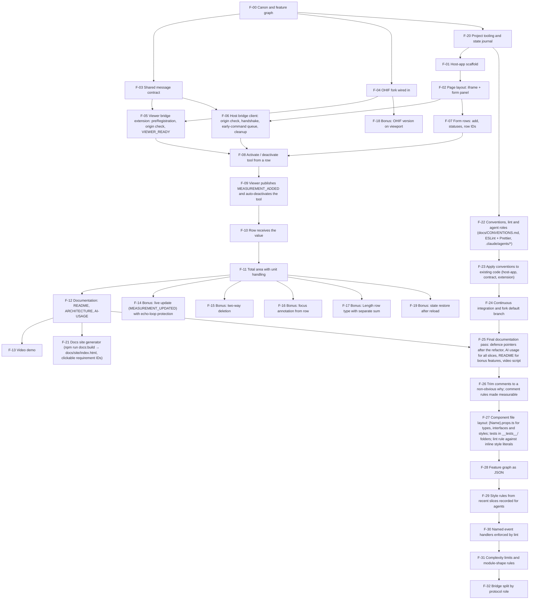

# Feature graph

Generated from docs/feature-graph.json by `npm run graph:build`. Do not edit by hand.

Derived from [CANON.md](CANON.md). Every node closes at least one canon ID. A node is started only when all of its dependencies are `done`. Bonus nodes (`S-*`) are planned only after the mandatory part is `done`.

Statuses: `planned` → `approved` → `in-progress` → `review` → `done`.

## Nodes

| Node | Name                                                                                                                                              | Canon                                                           | Depends on       | Slice | Status  | Verify                                                                                                                                                                                                                             |
| ---- | ------------------------------------------------------------------------------------------------------------------------------------------------- | --------------------------------------------------------------- | ---------------- | ----- | ------- | ---------------------------------------------------------------------------------------------------------------------------------------------------------------------------------------------------------------------------------- |
| F-00 | Canon and feature graph                                                                                                                           | A-1, A-2, A-3, A-4, A-5, D-2, D-3, D-4, D-6                     | —                | 0     | done    | Coverage check: every `C/Q/D` ID appears in this table; no cycles; diagram matches table.                                                                                                                                          |
| F-01 | Host-app scaffold                                                                                                                                 | A-2, C-3.3, C-4.2.1, C-4.2.3                                    | F-20             | 1     | done    | `npm run dev` in `host-app/` serves on port 5173; `tsc --noEmit` and lint pass with `strict`.                                                                                                                                      |
| F-02 | Page layout: iframe + form panel                                                                                                                  | C-4.1.3, C-4.2.2                                                | F-01             | 1     | done    | Page shows a full-height flexible iframe on the left pointing at `http://localhost:3000/viewer?StudyInstanceUIDs=…` and a form panel on the right.                                                                                 |
| F-03 | Shared message contract                                                                                                                           | C-4.4.1, C-4.4.2, C-4.4.3, P-7, P-8, Q-7                        | F-00             | 2     | done    | Types for the five events with `version: 1`; runtime guard rejects malformed / wrong-version messages; unit tests for serialisation and validation pass (X-4).                                                                     |
| F-04 | OHIF fork wired in                                                                                                                                | A-1, C-4.1.1, C-4.1.2, C-4.1.3, D-1                             | F-00             | 2     | done    | Fork added as submodule under `viewer/`; `yarn dev` serves on port 3000; a direct study link opens with the default public DICOMweb.                                                                                               |
| F-05 | Viewer bridge extension: `preRegistration`, origin check, `VIEWER_READY`                                                                          | C-3.1, C-3.2, C-3.4, Q-2, Q-5                                   | F-03, F-04       | 2     | done    | Extension registered in the fork's app config; on load the parent receives `VIEWER_READY` with correct `targetOrigin`; messages from a foreign origin are ignored (manual `postMessage` from devtools).                            |
| F-06 | Host bridge client: origin check, handshake, early-command queue, cleanup                                                                         | C-3.1, P-1, P-9, Q-1, Q-2, Q-5                                  | F-02, F-03       | 2     | done    | Clicking "Activate" before the iframe is ready queues the command; it is flushed after `VIEWER_READY`; listeners are removed on unmount (React StrictMode double-mount leaves one listener).                                       |
| F-07 | Form rows: add, statuses, row IDs                                                                                                                 | C-4.3.1, C-4.3.2, C-4.3.7, Q-3                                  | F-02             | 3     | done    | "Add measurement" creates rows with unique IDs and status `Pending`; any number of rows can be added.                                                                                                                              |
| F-08 | Activate / deactivate tool from a row                                                                                                             | A-4, C-4.3.3, C-4.4.1, P-7, Q-3                                 | F-05, F-06, F-07 | 3     | done    | "Activate" switches the row to `Drawing…` and the viewer to `EllipticalROI`; cancel sends `DEACTIVATE_TOOL`, row returns to `Pending`, viewer returns to the default tool.                                                         |
| F-09 | Viewer publishes `MEASUREMENT_ADDED` and auto-deactivates the tool                                                                                | C-3.4, C-4.3.4, C-4.3.5, C-4.3.6, P-3, P-4, Q-3, Q-6            | F-08             | 4     | done    | Drawing an ellipse produces one `MEASUREMENT_ADDED` with area, units (`mm²` / `px²`), row correlation ID and annotation ID; the viewer tool returns to default.                                                                    |
| F-10 | Row receives the value                                                                                                                            | C-4.3.5, C-4.3.6, Q-6                                           | F-09             | 4     | done    | The correct row shows the value with its unit and status `Done`; a measurement that arrives for an unknown or non-`Drawing…` row is ignored and logged.                                                                            |
| F-11 | Total area with unit handling                                                                                                                     | C-4.3.8, Q-6, X-4                                               | F-10             | 5     | done    | Sum is shown per unit (mm² and px² never added together); recalculates on every change; unit tests for the sum logic pass.                                                                                                         |
| F-12 | Documentation: README, ARCHITECTURE, AI-USAGE                                                                                                     | D-5, D-6, D-7, P-2, P-5, P-6                                    | F-11             | 6     | done    | Fresh clone → both apps running by following README only; ARCHITECTURE has the diagram, full payload table and "Decisions"; AI-USAGE is honest and specific.                                                                       |
| F-13 | Video demo                                                                                                                                        | D-8                                                             | F-12             | 6     | planned | 2–4 min recording covering D-8 (a)–(e).                                                                                                                                                                                            |
| F-14 | Bonus: live update (`MEASUREMENT_UPDATED`) with echo-loop protection                                                                              | P-6, Q-4, S-5.1                                                 | F-11             | 7     | done    | Dragging a handle updates the row and the sum live; a host-originated change does not bounce back as a second update.                                                                                                              |
| F-15 | Bonus: two-way deletion                                                                                                                           | C-4.4.2, Q-4, S-5.2                                             | F-11             | 8     | done    | Row "Delete" removes the annotation; deleting in the viewer clears the row.                                                                                                                                                        |
| F-16 | Bonus: focus annotation from row                                                                                                                  | C-4.4.2, S-5.3                                                  | F-11             | 11    | done    | Clicking a row highlights / jumps to the annotation.                                                                                                                                                                               |
| F-17 | Bonus: Length row type with separate sum                                                                                                          | S-5.4                                                           | F-11             | 22    | done    | Adding a length row arms the Length tool in OHIF and the drawn line lands in that row in mm; area and length totals are shown separately; 98 unit tests pass.                                                                      |
| F-18 | Bonus: OHIF version on viewport                                                                                                                   | S-5.5                                                           | F-04             | 9     | done    | Version from `package.json` injected at build time appears on each viewport in a 2×2 grid.                                                                                                                                         |
| F-19 | Bonus: state restore after reload                                                                                                                 | S-5.6                                                           | F-11             | later | planned | Reload keeps rows and annotations in sync.                                                                                                                                                                                         |
| F-20 | Project tooling and state journal                                                                                                                 | A-6, D-2, D-3, D-5                                              | F-00             | 0.5   | done    | `npm run check:graph` exits 0; `.nvmrc` + `engines` pin Node 22; `docs/STATE.md` lets a fresh session resume; decision records exist for A-1..A-6.                                                                                 |
| F-21 | Docs site generator (`npm run docs:build` → `docs/site/index.html`, clickable requirement IDs)                                                    | D-3, D-6                                                        | F-12             | 10    | done    | `npm run docs:build` produces a single self-contained page; opening it shows every document, IDs link to canon / graph rows / decision files.                                                                                      |
| F-22 | Conventions, lint and agent roles (`docs/CONVENTIONS.md`, ESLint + Prettier, `.claude/agents/*`)                                                  | A-13, D-3, Q-7                                                  | F-20             | 12    | done    | `npm run lint` runs ESLint with typescript-eslint strict and react-hooks; `npm run format:check` runs Prettier; agent role files exist and CLAUDE.md points to them.                                                               |
| F-23 | Apply conventions to existing code (host-app, contract, extension)                                                                                | A-13, Q-7                                                       | F-22             | 13    | done    | `npm run lint` and `format:check` exit 0 with zero warnings; all tests green; fork extension passes the same rules.                                                                                                                |
| F-24 | Continuous integration and fork default branch                                                                                                    | D-3, D-4, D-5, Q-7                                              | F-23             | 14    | done    | GitHub Actions runs lint, lint:fork, format:check, typecheck, test, build, check:graph and check:contract on every PR and push to main; the fork's default branch is `scoring`.                                                    |
| F-25 | Final documentation pass: defence pointers after the refactor, AI usage for all slices, README for bonus features, video script                   | D-5, D-6, D-7, D-8, P-1, P-2, P-3, P-4, P-5, P-6, P-7, P-8, P-9 | F-12, F-24       | 15    | done    | Every `file:line` pointer in DEFENCE.md resolves to the cited symbol; AI-USAGE covers slices 0–15; README describes all implemented bonuses; clean-clone run of README succeeds.                                                   |
| F-26 | Trim comments to a non-obvious why; comment rules made measurable                                                                                 | A-13, Q-7                                                       | F-25             | 16    | done    | Comment lines ≤ ~10% of non-blank lines per file; no behaviour change (all checks and end-to-end green); every removed rationale that matters is present in `docs/decisions/`, ARCHITECTURE or DEFENCE; DEFENCE links re-verified. |
| F-27 | Component file layout: `{Name}.props.ts` for types, interfaces and styles; tests in `__tests__/` folders; lint rule against inline style literals | A-13, Q-7                                                       | F-26             | 17    | done    | Every component with props or styles has a sibling `.props.ts`; no `style={{…}}` literals (lint); every test file sits in a `__tests__/` folder next to its module; lint, typecheck, 89 tests and end-to-end unchanged.            |
| F-28 | Feature graph as JSON                                                                                                                             | D-3, D-6, Q-7                                                   | F-27             | 18    | done    | `npm run graph:build` is idempotent; `npm run check:graph` passes and fails on a missing file, a hand edit of FEATURE-GRAPH.md or a stale import list.                                                                             |
| F-29 | Style rules from recent slices recorded for agents                                                                                                | A-13, D-3, Q-7                                                  | F-28             | 19    | done    | Role files and CONVENTIONS agree; npm run format:check and check:graph pass.                                                                                                                                                       |
| F-30 | Named event handlers enforced by lint                                                                                                             | A-13, Q-7                                                       | F-29             | 20    | done    | npm run lint reports an inline handler as an error; no on-prop in host-app creates a function; 89 tests and the end-to-end scenarios unchanged.                                                                                    |
| F-31 | Complexity limits and module-shape rules                                                                                                          | A-13, Q-7                                                       | F-30             | 24    | done    | npm run lint and lint:fork report the seven known hot spots as warnings and nothing else; the rules are off for test suites.                                                                                                       |
| F-32 | Bridge split by protocol role                                                                                                                     | A-13, C-3.4, Q-7                                                | F-31             | 25    | review  | npm run lint:fork reports no size or complexity warnings for the extension; the full browser regression (ready, activate, measure, restore tool, live update, delete both ways, focus, version overlay) behaves as before.         |

## Coverage of mandatory IDs

| ID      | Covered by                                                       |
| ------- | ---------------------------------------------------------------- |
| C-3.1   | F-05, F-06                                                       |
| C-3.2   | F-05                                                             |
| C-3.3   | F-01                                                             |
| C-3.4   | F-05, F-09, F-32                                                 |
| C-4.1.1 | F-04                                                             |
| C-4.1.2 | F-04                                                             |
| C-4.1.3 | F-02, F-04                                                       |
| C-4.2.1 | F-01                                                             |
| C-4.2.2 | F-02                                                             |
| C-4.2.3 | F-01                                                             |
| C-4.3.1 | F-07                                                             |
| C-4.3.2 | F-07                                                             |
| C-4.3.3 | F-08                                                             |
| C-4.3.4 | F-09                                                             |
| C-4.3.5 | F-09, F-10                                                       |
| C-4.3.6 | F-09, F-10                                                       |
| C-4.3.7 | F-07                                                             |
| C-4.3.8 | F-11                                                             |
| C-4.4.1 | F-03, F-08                                                       |
| C-4.4.2 | F-03, F-15, F-16                                                 |
| C-4.4.3 | F-03                                                             |
| Q-1     | F-06                                                             |
| Q-2     | F-05, F-06                                                       |
| Q-3     | F-07, F-08, F-09                                                 |
| Q-4     | F-14, F-15                                                       |
| Q-5     | F-05, F-06                                                       |
| Q-6     | F-09, F-10, F-11                                                 |
| Q-7     | F-03, F-22, F-23, F-24, F-26, F-27, F-28, F-29, F-30, F-31, F-32 |
| D-1     | F-04                                                             |
| D-2     | F-00, F-20                                                       |
| D-3     | F-00, F-20, F-21, F-22, F-24, F-28, F-29                         |
| D-4     | F-00, F-24                                                       |
| D-5     | F-12, F-20, F-24, F-25                                           |
| D-6     | F-00, F-12, F-21, F-25, F-28                                     |
| D-7     | F-12, F-25                                                       |
| D-8     | F-13, F-25                                                       |

## Diagram

## Slice → nodes

| Slice                                                 | Branch                                      | PR  | Nodes                  |
| ----------------------------------------------------- | ------------------------------------------- | --- | ---------------------- |
| 0 — docs: canon and feature graph                     | `docs/canon-and-feature-graph`              | #1  | F-00                   |
| 0.5 — chore: project tooling and state journal        | `chore/project-tooling-and-state-journal`   | #2  | F-20                   |
| 1 — chore: bootstrap host-app                         | `chore/bootstrap-host-app`                  | #3  | F-01, F-02             |
| 2 — feat: viewer bridge extension                     | `feat/viewer-bridge-extension`              | #4  | F-03, F-04, F-05, F-06 |
| 3 — feat: activate ellipse from form                  | `feat/activate-ellipse-from-form`           | #5  | F-07, F-08             |
| 4 — feat: receive measurement into form               | `feat/receive-measurement-into-form`        | #6  | F-09, F-10             |
| 5 — feat: total area calculation                      | `feat/total-area-calculation`               | #7  | F-11                   |
| 6 — docs: README, ARCHITECTURE, AI-USAGE              | `docs/readme-architecture-ai-usage`         | #8  | F-12, F-13             |
| 7 — feat: live measurement update                     | `feat/live-measurement-update`              | #9  | F-14                   |
| 8 — feat: two-way deletion                            | `feat/two-way-deletion`                     | #10 | F-15                   |
| 9 — feat: OHIF version on viewport                    | `feat/ohif-version-on-viewport`             | #11 | F-18                   |
| 10 — chore: docs site generator                       | `chore/docs-site-generator`                 | #12 | F-21                   |
| 11 — feat: focus measurement from row                 | `feat/focus-measurement-from-row`           | #13 | F-16                   |
| 12 — chore: conventions, lint and agent roles         | `chore/conventions-lint-and-agent-roles`    | #14 | F-22                   |
| 13 — refactor: apply conventions                      | `refactor/apply-conventions`                | #15 | F-23                   |
| 14 — ci: checks and fork default branch               | `ci/checks-and-fork-default-branch`         | #16 | F-24                   |
| 15 — docs: final pass                                 | `docs/final-pass`                           | #17 | F-25                   |
| 16 — refactor: trim comments                          | `refactor/trim-comments`                    | #18 | F-26                   |
| 17 — refactor: component props files and test folders | `refactor/component-props-and-test-folders` | #19 | F-27                   |
| 18 — docs: feature graph as JSON                      | `docs/feature-graph-json`                   | —   | F-28                   |
| later — bonus nodes not yet scheduled                 | one branch per bonus node                   | —   | F-19                   |
| 19 — docs: agent style rules                          | `docs/agent-style-rules`                    | —   | F-29                   |
| 20 — refactor: named event handlers                   | `refactor/named-event-handlers`             | —   | F-30                   |
| 21 — docs: close graph statuses                       | `docs/close-graph-statuses`                 | —   | —                      |
| 22 — feat: length row type                            | `feat/length-row-type`                      | —   | F-17                   |
| 23 — docs: length in defence script                   | `docs/length-in-defence`                    | —   | —                      |
| 24 — chore: complexity rules                          | `chore/complexity-rules`                    | —   | F-31                   |
| 25 — refactor: split the bridge                       | `refactor/split-bridge`                     | —   | F-32                   |

## Node details

### F-00 Canon and feature graph

Splits the test assignment into atomic requirements with immutable IDs (C, Q, S, D, X, P) in docs/CANON.md and derives the feature graph from them. The canon also seeds the decisions section, starting with A-1..A-5 (repository layout, ports, defence-readiness IDs, cancelled activation, deferred bridge decisions). Every later node traces back to these IDs.

Canon: A-1, A-2, A-3, A-4, A-5, D-2, D-3, D-4, D-6. Depends on: —. Slice 0, status `done`.

Files:

- `docs/CANON.md`
- `docs/FEATURE-GRAPH.md`

### F-01 Host-app scaffold

Creates the host-app as a Vite + React + TypeScript workspace in strict mode. The dev server is pinned to port 5173 and the viewer origin to port 3000 in a single config module (A-2), so the two apps are cross-origin by construction. User-visible strings are collected in one Ukrainian strings file (A-7).

Canon: A-2, C-3.3, C-4.2.1, C-4.2.3. Depends on: F-20. Slice 1, status `done`.

Files:

- `docs/decisions/A-2-ports.md`
- `docs/decisions/A-7-ui-language.md`
- `host-app/.gitignore`
- `host-app/index.html`
- `host-app/package.json`
- `host-app/public/favicon.svg`
- `host-app/src/config.ts` — internal: `packages/contract/src/messages.ts`
- `host-app/src/index.css`
- `host-app/src/main.tsx` — internal: `host-app/src/App.tsx`, `host-app/src/index.css`; external: `react`, `react-dom`
- `host-app/src/setup-tests.ts` — external: `@testing-library/jest-dom`, `@testing-library/react`, `vitest`
- `host-app/src/ui-strings.ts` — no imports
- `host-app/tsconfig.app.json`
- `host-app/tsconfig.json`
- `host-app/tsconfig.node.json`
- `host-app/vite.config.ts` — external: `@vitejs/plugin-react`, `vite`

### F-02 Page layout: iframe + form panel

Renders the single page: a flexible full-height iframe on the left and the scoring form panel on the right. The iframe source is the direct study link built from config, which is how OHIF is opened on a specific study.

Canon: C-4.1.3, C-4.2.2. Depends on: F-01. Slice 1, status `done`.

Files:

- `host-app/src/App.css`
- `host-app/src/App.tsx` — internal: `host-app/src/App.css`, `host-app/src/bridge/useBridge.ts`, `host-app/src/components/BridgeStatus.tsx`, `host-app/src/components/ScoringPanel.tsx`, `host-app/src/components/ViewerFrame.tsx`, `host-app/src/form/useScoringForm.ts`; external: `react`
- `host-app/src/__tests__/App.test.tsx` — internal: `host-app/src/App.tsx`, `host-app/src/config.ts`, `host-app/src/ui-strings.ts`; external: `@testing-library/react`, `vitest`
- `host-app/src/components/ScoringPanel.props.ts` — internal: `host-app/src/form/rows.ts`, `packages/contract/src/messages.ts`; external: `react`
- `host-app/src/components/ScoringPanel.tsx` — internal: `host-app/src/components/MeasurementRow.tsx`, `host-app/src/components/ScoringPanel.props.ts`, `host-app/src/components/TotalsFooter.tsx`, `host-app/src/config.ts`, `host-app/src/form/totals.ts`, `host-app/src/ui-strings.ts`; external: `react`
- `host-app/src/components/ViewerFrame.props.ts` — external: `react`
- `host-app/src/components/ViewerFrame.tsx` — internal: `host-app/src/components/ViewerFrame.props.ts`, `host-app/src/config.ts`, `host-app/src/ui-strings.ts`; external: `react`

### F-03 Shared message contract

Declares every message type with literal `type` values and `version: 1` in one package, `@scoring/contract`, together with runtime guards `isHostCommand` and `isViewerEvent` that reject malformed or wrong-version payloads. The viewer submodule keeps a byte-identical copy of the file, checked by `npm run check:contract` (A-12). The tool name and the `metrics` object in the payload keep P-7 and P-8 changes local.

Canon: C-4.4.1, C-4.4.2, C-4.4.3, P-7, P-8, Q-7. Depends on: F-00. Slice 2, status `done`.

Files:

- `docs/decisions/A-12-npm-workspaces.md`
- `packages/contract/README.md`
- `packages/contract/package.json`
- `packages/contract/src/__tests__/messages.test.ts` — internal: `packages/contract/src/messages.ts`; external: `vitest`
- `packages/contract/src/messages.ts` — no imports
- `packages/contract/tsconfig.json`
- `scripts/check-contract-sync.mjs` — external: `node:fs`, `node:path`
- `viewer/extensions/scoring-bridge/src/contract/messages.ts` — no imports

### F-04 OHIF fork wired in

Adds the OHIF fork as a git submodule under `viewer/`, on branch `scoring` based on release v3.12.17 (A-1, A-6). The fork runs locally on port 3000 against the default public DICOMweb data source and opens a study by direct link. The extension is registered in the fork's plugin config.

Canon: A-1, C-4.1.1, C-4.1.2, C-4.1.3, D-1. Depends on: F-00. Slice 2, status `done`.

Files:

- `.gitmodules`
- `docs/decisions/A-1-mono-repo-with-submodule.md`
- `docs/decisions/A-6-ohif-base-version.md`
- `viewer/platform/app/package.json`
- `viewer/platform/app/pluginConfig.json`

### F-05 Viewer bridge extension: `preRegistration`, origin check, `VIEWER_READY`

The `scoring-bridge` OHIF extension obtains `servicesManager` and `commandsManager` in `preRegistration` and creates the bridge there. The bridge listens for `message` events, ignores any origin other than the configured host origin, and posts to the parent with an explicit `targetOrigin`. `VIEWER_READY` is sent on the first `VIEWPORT_ADDED`, because tool activation is a no-op before a viewport exists; all subscriptions are released on teardown.

Canon: C-3.1, C-3.2, C-3.4, Q-2, Q-5. Depends on: F-03, F-04. Slice 2, status `done`.

Files:

- `viewer/extensions/scoring-bridge/babel.config.js` — no imports
- `viewer/extensions/scoring-bridge/package.json`
- `viewer/extensions/scoring-bridge/src/bridge.ts` — internal: `viewer/extensions/scoring-bridge/src/commands.ts`, `viewer/extensions/scoring-bridge/src/config.ts`, `viewer/extensions/scoring-bridge/src/focus.ts`, `viewer/extensions/scoring-bridge/src/handshake.ts`, `viewer/extensions/scoring-bridge/src/measurementStream.ts`, `viewer/extensions/scoring-bridge/src/messaging.ts`, `viewer/extensions/scoring-bridge/src/removals.ts`, `viewer/extensions/scoring-bridge/src/reportedMeasurements.ts`
- `viewer/extensions/scoring-bridge/src/config.ts` — no imports
- `viewer/extensions/scoring-bridge/src/id.js` — internal: `viewer/extensions/scoring-bridge/package.json`
- `viewer/extensions/scoring-bridge/src/index.tsx` — internal: `viewer/extensions/scoring-bridge/src/bridge.ts`, `viewer/extensions/scoring-bridge/src/getCustomizationModule.tsx`, `viewer/extensions/scoring-bridge/src/id.js`; external: `@ohif/core`

### F-06 Host bridge client: origin check, handshake, early-command queue, cleanup

`createBridge` accepts only messages from the viewer origin that pass `isViewerEvent`, keeps a `ready` flag and a FIFO queue, and flushes queued commands in order on `VIEWER_READY` (A-9). `useBridge` binds it to React and removes the listener on unmount, so StrictMode double mounts leave one listener. `BridgeStatus` shows readiness and the queued count for diagnosis (P-9).

Canon: C-3.1, P-1, P-9, Q-1, Q-2, Q-5. Depends on: F-02, F-03. Slice 2, status `done`.

Files:

- `docs/decisions/A-9-handshake-and-queue.md`
- `host-app/src/bridge/__tests__/createBridge.test.ts` — internal: `host-app/src/bridge/createBridge.ts`, `packages/contract/src/messages.ts`; external: `vitest`
- `host-app/src/bridge/__tests__/useBridge.test.tsx` — internal: `host-app/src/bridge/useBridge.ts`; external: `@testing-library/react`, `react`, `vitest`
- `host-app/src/bridge/createBridge.ts` — internal: `packages/contract/src/messages.ts`
- `host-app/src/bridge/useBridge.ts` — internal: `host-app/src/bridge/createBridge.ts`, `host-app/src/config.ts`, `packages/contract/src/messages.ts`; external: `react`
- `host-app/src/components/BridgeStatus.props.ts` — internal: `host-app/src/bridge/createBridge.ts`; external: `react`
- `host-app/src/components/BridgeStatus.tsx` — internal: `host-app/src/components/BridgeStatus.props.ts`, `host-app/src/ui-strings.ts`; external: `react`

### F-07 Form rows: add, statuses, row IDs

The form keeps rows in a pure reducer with string-enum statuses. "Add measurement" creates a row with a host-issued UUID and status `Pending`, and any number of rows can be added. The host owns `rowId` so an empty row exists before anything is drawn (A-8).

Canon: C-4.3.1, C-4.3.2, C-4.3.7, Q-3. Depends on: F-02. Slice 3, status `done`.

Files:

- `host-app/src/components/MeasurementRow.props.ts` — internal: `host-app/src/form/rows.ts`; external: `react`
- `host-app/src/components/MeasurementRow.tsx` — internal: `host-app/src/components/MeasurementRow.props.ts`, `host-app/src/form/format.ts`, `host-app/src/form/rows.ts`, `host-app/src/ui-strings.ts`, `packages/contract/src/messages.ts`; external: `react`
- `host-app/src/form/__tests__/rows.test.ts` — internal: `host-app/src/form/rows.ts`, `packages/contract/src/messages.ts`; external: `vitest`
- `host-app/src/form/__tests__/useScoringForm.test.tsx` — internal: `host-app/src/config.ts`, `host-app/src/form/rows.ts`, `host-app/src/form/totals.ts`, `host-app/src/form/useScoringForm.ts`, `packages/contract/src/messages.ts`; external: `@testing-library/react`, `vitest`
- `host-app/src/form/rows.ts` — internal: `host-app/src/config.ts`, `packages/contract/src/messages.ts`
- `host-app/src/form/useScoringForm.ts` — internal: `host-app/src/config.ts`, `host-app/src/form/rows.ts`, `packages/contract/src/messages.ts`; external: `react`

### F-08 Activate / deactivate tool from a row

"Activate" sends `ACTIVATE_TOOL` with `rowId` and the configured tool name and moves the row to `Drawing…`; activating another row or cancelling sends `DEACTIVATE_TOOL` and returns the row to `Pending` (A-4). In the viewer, `commands.ts` snapshots the active primary tool, arms the requested tool and restores the snapshot on disarm (A-8). The tool name is one constant in host config (P-7).

Canon: A-4, C-4.3.3, C-4.4.1, P-7, Q-3. Depends on: F-05, F-06, F-07. Slice 3, status `done`.

Files:

- `docs/decisions/A-4-cancelled-activation.md`
- `host-app/src/config.ts` — internal: `packages/contract/src/messages.ts`
- `host-app/src/form/useScoringForm.ts` — internal: `host-app/src/config.ts`, `host-app/src/form/rows.ts`, `packages/contract/src/messages.ts`; external: `react`
- `viewer/extensions/scoring-bridge/src/commands.ts` — internal: `viewer/extensions/scoring-bridge/src/config.ts`, `viewer/extensions/scoring-bridge/src/contract/messages.ts`

### F-09 Viewer publishes `MEASUREMENT_ADDED` and auto-deactivates the tool

The bridge subscribes to `measurementService` `MEASUREMENT_ADDED`, maps the OHIF measurement to `metrics` with its unit copied from `cachedStats`, records `uid → rowId`, and posts `MEASUREMENT_ADDED` with the armed row ID and the annotation UID. It then restores the previous tool and disarms. The viewer issues the measurement ID because OHIF rejects foreign fields on measurements (A-8, P-3).

Canon: C-3.4, C-4.3.4, C-4.3.5, C-4.3.6, P-3, P-4, Q-3, Q-6. Depends on: F-08. Slice 4, status `done`.

Files:

- `docs/decisions/A-11-units-and-metrics-payload.md`
- `docs/decisions/A-8-id-correlation.md`
- `viewer/extensions/scoring-bridge/src/bridge.ts` — internal: `viewer/extensions/scoring-bridge/src/commands.ts`, `viewer/extensions/scoring-bridge/src/config.ts`, `viewer/extensions/scoring-bridge/src/focus.ts`, `viewer/extensions/scoring-bridge/src/handshake.ts`, `viewer/extensions/scoring-bridge/src/measurementStream.ts`, `viewer/extensions/scoring-bridge/src/messaging.ts`, `viewer/extensions/scoring-bridge/src/removals.ts`, `viewer/extensions/scoring-bridge/src/reportedMeasurements.ts`
- `viewer/extensions/scoring-bridge/src/commands.ts` — internal: `viewer/extensions/scoring-bridge/src/config.ts`, `viewer/extensions/scoring-bridge/src/contract/messages.ts`
- `viewer/extensions/scoring-bridge/src/measurements.ts` — internal: `viewer/extensions/scoring-bridge/src/config.ts`, `viewer/extensions/scoring-bridge/src/contract/messages.ts`

### F-10 Row receives the value

The form hook applies `MEASUREMENT_ADDED` to the row in `Drawing…` with the matching `rowId`, stores the measurement UID, value and unit, and sets status `Done`. Events with `rowId: null` or for an unknown or non-drawing row are ignored and logged. Values are formatted with their unit.

Canon: C-4.3.5, C-4.3.6, Q-6. Depends on: F-09. Slice 4, status `done`.

Files:

- `host-app/src/components/MeasurementRow.tsx` — internal: `host-app/src/components/MeasurementRow.props.ts`, `host-app/src/form/format.ts`, `host-app/src/form/rows.ts`, `host-app/src/ui-strings.ts`, `packages/contract/src/messages.ts`; external: `react`
- `host-app/src/form/__tests__/format.test.ts` — internal: `host-app/src/form/format.ts`; external: `vitest`
- `host-app/src/form/__tests__/useScoringForm.test.tsx` — internal: `host-app/src/config.ts`, `host-app/src/form/rows.ts`, `host-app/src/form/totals.ts`, `host-app/src/form/useScoringForm.ts`, `packages/contract/src/messages.ts`; external: `@testing-library/react`, `vitest`
- `host-app/src/form/format.ts` — internal: `packages/contract/src/messages.ts`
- `host-app/src/form/rows.ts` — internal: `host-app/src/config.ts`, `packages/contract/src/messages.ts`
- `host-app/src/form/useScoringForm.ts` — internal: `host-app/src/config.ts`, `host-app/src/form/rows.ts`, `packages/contract/src/messages.ts`; external: `react`

### F-11 Total area with unit handling

`computeTotals` sums row values per unit, so mm² and px² are never added together (A-11), and the totals footer re-renders on every row change. The sum logic is covered by unit tests, within the test budget of X-4.

Canon: C-4.3.8, Q-6, X-4. Depends on: F-10. Slice 5, status `done`.

Files:

- `host-app/src/components/TotalsFooter.props.ts` — internal: `host-app/src/form/totals.ts`, `packages/contract/src/messages.ts`; external: `react`
- `host-app/src/components/TotalsFooter.tsx` — internal: `host-app/src/components/TotalsFooter.props.ts`, `host-app/src/form/format.ts`, `host-app/src/ui-strings.ts`; external: `react`
- `host-app/src/components/__tests__/ScoringPanel.test.tsx` — internal: `host-app/src/components/ScoringPanel.tsx`, `host-app/src/form/rows.ts`; external: `@testing-library/react`, `vitest`
- `host-app/src/form/__tests__/totals.test.ts` — internal: `host-app/src/form/rows.ts`, `host-app/src/form/totals.ts`, `packages/contract/src/messages.ts`; external: `vitest`
- `host-app/src/form/totals.ts` — internal: `host-app/src/form/rows.ts`, `packages/contract/src/messages.ts`

### F-12 Documentation: README, ARCHITECTURE, AI-USAGE

README describes the run from a clean clone to a working screen. ARCHITECTURE holds the exchange diagram, the full message table with payloads and the Decisions section (IDs, handshake, early commands, echo loop). AI-USAGE records where AI was used and what was kept or rewritten; DEFENCE.md answers the P-questions with file pointers.

Canon: D-5, D-6, D-7, P-2, P-5, P-6. Depends on: F-11. Slice 6, status `done`.

Files:

- `AI-USAGE.md`
- `ARCHITECTURE.md`
- `README.md`
- `docs/DEFENCE.md`

### F-13 Video demo

A 2–4 minute recording showing both apps starting, at least three measurements, the sum updating, a cancelled activation and the implemented bonuses. It is recorded by the author outside the repository; the script lives in DEFENCE.md.

Canon: D-8. Depends on: F-12. Slice 6, status `planned`.

Files:

_No files yet._

### F-14 Bonus: live update (`MEASUREMENT_UPDATED`) with echo-loop protection

The bridge publishes `MEASUREMENT_UPDATED` for measurements bound to a row, throttled per UID to one event per 100 ms with a trailing emit and skipped when the value is unchanged. The host reducer updates the row value and the totals follow. The host never sends a command in reaction to a measurement event, so no loop can form (A-10).

Canon: P-6, Q-4, S-5.1. Depends on: F-11. Slice 7, status `done`.

Files:

- `docs/decisions/A-10-echo-guard.md`
- `host-app/src/form/__tests__/rows.test.ts` — internal: `host-app/src/form/rows.ts`, `packages/contract/src/messages.ts`; external: `vitest`
- `host-app/src/form/__tests__/useScoringForm.test.tsx` — internal: `host-app/src/config.ts`, `host-app/src/form/rows.ts`, `host-app/src/form/totals.ts`, `host-app/src/form/useScoringForm.ts`, `packages/contract/src/messages.ts`; external: `@testing-library/react`, `vitest`
- `host-app/src/form/rows.ts` — internal: `host-app/src/config.ts`, `packages/contract/src/messages.ts`
- `host-app/src/form/useScoringForm.ts` — internal: `host-app/src/config.ts`, `host-app/src/form/rows.ts`, `packages/contract/src/messages.ts`; external: `react`
- `viewer/extensions/scoring-bridge/src/bridge.ts` — internal: `viewer/extensions/scoring-bridge/src/commands.ts`, `viewer/extensions/scoring-bridge/src/config.ts`, `viewer/extensions/scoring-bridge/src/focus.ts`, `viewer/extensions/scoring-bridge/src/handshake.ts`, `viewer/extensions/scoring-bridge/src/measurementStream.ts`, `viewer/extensions/scoring-bridge/src/messaging.ts`, `viewer/extensions/scoring-bridge/src/removals.ts`, `viewer/extensions/scoring-bridge/src/reportedMeasurements.ts`
- `viewer/extensions/scoring-bridge/src/measurements.ts` — internal: `viewer/extensions/scoring-bridge/src/config.ts`, `viewer/extensions/scoring-bridge/src/contract/messages.ts`
- `viewer/extensions/scoring-bridge/src/throttle.ts` — no imports

### F-15 Bonus: two-way deletion

Row "Delete" sends `REMOVE_MEASUREMENT` with a `requestId`; the viewer parks the request ID, removes the measurement and returns it as `causedBy` in `MEASUREMENT_REMOVED`. A deletion made in OHIF arrives without the host's `causedBy` and returns the row to `Pending`. The contract gained two message types in version 1 (C-4.4.2).

Canon: C-4.4.2, Q-4, S-5.2. Depends on: F-11. Slice 8, status `done`.

Files:

- `host-app/src/components/MeasurementRow.tsx` — internal: `host-app/src/components/MeasurementRow.props.ts`, `host-app/src/form/format.ts`, `host-app/src/form/rows.ts`, `host-app/src/ui-strings.ts`, `packages/contract/src/messages.ts`; external: `react`
- `host-app/src/components/__tests__/ScoringPanel.test.tsx` — internal: `host-app/src/components/ScoringPanel.tsx`, `host-app/src/form/rows.ts`; external: `@testing-library/react`, `vitest`
- `host-app/src/form/__tests__/rows.test.ts` — internal: `host-app/src/form/rows.ts`, `packages/contract/src/messages.ts`; external: `vitest`
- `host-app/src/form/__tests__/useScoringForm.test.tsx` — internal: `host-app/src/config.ts`, `host-app/src/form/rows.ts`, `host-app/src/form/totals.ts`, `host-app/src/form/useScoringForm.ts`, `packages/contract/src/messages.ts`; external: `@testing-library/react`, `vitest`
- `host-app/src/form/rows.ts` — internal: `host-app/src/config.ts`, `packages/contract/src/messages.ts`
- `host-app/src/form/useScoringForm.ts` — internal: `host-app/src/config.ts`, `host-app/src/form/rows.ts`, `packages/contract/src/messages.ts`; external: `react`
- `packages/contract/src/__tests__/messages.test.ts` — internal: `packages/contract/src/messages.ts`; external: `vitest`
- `packages/contract/src/messages.ts` — no imports
- `viewer/extensions/scoring-bridge/src/bridge.ts` — internal: `viewer/extensions/scoring-bridge/src/commands.ts`, `viewer/extensions/scoring-bridge/src/config.ts`, `viewer/extensions/scoring-bridge/src/focus.ts`, `viewer/extensions/scoring-bridge/src/handshake.ts`, `viewer/extensions/scoring-bridge/src/measurementStream.ts`, `viewer/extensions/scoring-bridge/src/messaging.ts`, `viewer/extensions/scoring-bridge/src/removals.ts`, `viewer/extensions/scoring-bridge/src/reportedMeasurements.ts`
- `viewer/extensions/scoring-bridge/src/commands.ts` — internal: `viewer/extensions/scoring-bridge/src/config.ts`, `viewer/extensions/scoring-bridge/src/contract/messages.ts`
- `viewer/extensions/scoring-bridge/src/removals.ts` — internal: `viewer/extensions/scoring-bridge/src/config.ts`, `viewer/extensions/scoring-bridge/src/contract/messages.ts`

### F-16 Bonus: focus annotation from row

Clicking a `Done` row sends `FOCUS_MEASUREMENT` with the measurement UID. The viewer calls `measurementService.jumpToMeasurement`, which navigates to the annotation's image and selects it; unknown UIDs are ignored and nothing is sent back.

Canon: C-4.4.2, S-5.3. Depends on: F-11. Slice 11, status `done`.

Files:

- `host-app/src/components/MeasurementRow.tsx` — internal: `host-app/src/components/MeasurementRow.props.ts`, `host-app/src/form/format.ts`, `host-app/src/form/rows.ts`, `host-app/src/ui-strings.ts`, `packages/contract/src/messages.ts`; external: `react`
- `host-app/src/components/__tests__/ScoringPanel.test.tsx` — internal: `host-app/src/components/ScoringPanel.tsx`, `host-app/src/form/rows.ts`; external: `@testing-library/react`, `vitest`
- `host-app/src/form/__tests__/useScoringForm.test.tsx` — internal: `host-app/src/config.ts`, `host-app/src/form/rows.ts`, `host-app/src/form/totals.ts`, `host-app/src/form/useScoringForm.ts`, `packages/contract/src/messages.ts`; external: `@testing-library/react`, `vitest`
- `host-app/src/form/useScoringForm.ts` — internal: `host-app/src/config.ts`, `host-app/src/form/rows.ts`, `packages/contract/src/messages.ts`; external: `react`
- `packages/contract/src/__tests__/messages.test.ts` — internal: `packages/contract/src/messages.ts`; external: `vitest`
- `packages/contract/src/messages.ts` — no imports
- `viewer/extensions/scoring-bridge/src/commands.ts` — internal: `viewer/extensions/scoring-bridge/src/config.ts`, `viewer/extensions/scoring-bridge/src/contract/messages.ts`
- `viewer/extensions/scoring-bridge/src/focus.ts` — internal: `viewer/extensions/scoring-bridge/src/config.ts`, `viewer/extensions/scoring-bridge/src/contract/messages.ts`

### F-17 Bonus: Length row type with separate sum

A form row carries the tool it will arm (EllipticalROI or Length); the metric key to read is derived from that tool, never stored twice. The panel offers a button per kind, each row shows its kind and value, and the footer sums areas and lengths separately, each grouped by unit. The viewer needed no change: it already activates any tool named in ACTIVATE_TOOL and maps Length measurements.

Canon: S-5.4. Depends on: F-11. Slice 22, status `done`.

Files:

- `ARCHITECTURE.md`
- `host-app/src/components/MeasurementRow.tsx` — internal: `host-app/src/components/MeasurementRow.props.ts`, `host-app/src/form/format.ts`, `host-app/src/form/rows.ts`, `host-app/src/ui-strings.ts`, `packages/contract/src/messages.ts`; external: `react`
- `host-app/src/components/ScoringPanel.props.ts` — internal: `host-app/src/form/rows.ts`, `packages/contract/src/messages.ts`; external: `react`
- `host-app/src/components/ScoringPanel.tsx` — internal: `host-app/src/components/MeasurementRow.tsx`, `host-app/src/components/ScoringPanel.props.ts`, `host-app/src/components/TotalsFooter.tsx`, `host-app/src/config.ts`, `host-app/src/form/totals.ts`, `host-app/src/ui-strings.ts`; external: `react`
- `host-app/src/components/TotalsFooter.props.ts` — internal: `host-app/src/form/totals.ts`, `packages/contract/src/messages.ts`; external: `react`
- `host-app/src/components/TotalsFooter.tsx` — internal: `host-app/src/components/TotalsFooter.props.ts`, `host-app/src/form/format.ts`, `host-app/src/ui-strings.ts`; external: `react`
- `host-app/src/components/__tests__/ScoringPanel.test.tsx` — internal: `host-app/src/components/ScoringPanel.tsx`, `host-app/src/form/rows.ts`; external: `@testing-library/react`, `vitest`
- `host-app/src/config.ts` — internal: `packages/contract/src/messages.ts`
- `host-app/src/form/__tests__/rows.test.ts` — internal: `host-app/src/form/rows.ts`, `packages/contract/src/messages.ts`; external: `vitest`
- `host-app/src/form/__tests__/totals.test.ts` — internal: `host-app/src/form/rows.ts`, `host-app/src/form/totals.ts`, `packages/contract/src/messages.ts`; external: `vitest`
- `host-app/src/form/__tests__/useScoringForm.test.tsx` — internal: `host-app/src/config.ts`, `host-app/src/form/rows.ts`, `host-app/src/form/totals.ts`, `host-app/src/form/useScoringForm.ts`, `packages/contract/src/messages.ts`; external: `@testing-library/react`, `vitest`
- `host-app/src/form/rows.ts` — internal: `host-app/src/config.ts`, `packages/contract/src/messages.ts`
- `host-app/src/form/useScoringForm.ts` — internal: `host-app/src/config.ts`, `host-app/src/form/rows.ts`, `packages/contract/src/messages.ts`; external: `react`
- `host-app/src/ui-strings.ts` — no imports

### F-18 Bonus: OHIF version on viewport

The extension's customization module pushes a version item into `viewportOverlay.bottomRight`, so every viewport, including all panes of a 2×2 grid, shows the OHIF version. The version string is injected at build time by the fork's webpack DefinePlugin from `version.txt`.

Canon: S-5.5. Depends on: F-04. Slice 9, status `done`.

Files:

- `viewer/extensions/scoring-bridge/src/getCustomizationModule.tsx` — no imports
- `viewer/extensions/scoring-bridge/src/index.tsx` — internal: `viewer/extensions/scoring-bridge/src/bridge.ts`, `viewer/extensions/scoring-bridge/src/getCustomizationModule.tsx`, `viewer/extensions/scoring-bridge/src/id.js`; external: `@ohif/core`

### F-19 Bonus: state restore after reload

Restores form rows and viewer annotations after a page reload, keeping both in sync. Not implemented.

Canon: S-5.6. Depends on: F-11. Slice later, status `planned`.

Files:

_No files yet._

### F-20 Project tooling and state journal

Pins Node 22 through `.nvmrc` and `engines`, adds the root `package.json` with the graph checker, and starts `docs/STATE.md` as the resume point for a fresh session. Decision records A-1..A-6 get their own files under `docs/decisions/`.

Canon: A-6, D-2, D-3, D-5. Depends on: F-00. Slice 0.5, status `done`.

Files:

- `.claude/settings.json`
- `.nvmrc`
- `docs/STATE.md`
- `docs/decisions/A-3-defence-readiness-ids.md`
- `docs/decisions/A-5-deferred-bridge-decisions.md`
- `docs/decisions/README.md`
- `package.json`

### F-21 Docs site generator (`npm run docs:build` → `docs/site/index.html`, clickable requirement IDs)

`scripts/build-docs.mjs` bundles every project document into one self-contained HTML page rendered client-side from a template. Requirement and decision IDs link back to their home documents, and Mermaid blocks are rendered when the CDN is reachable. CI fails when the committed page is stale.

Canon: D-3, D-6. Depends on: F-12. Slice 10, status `done`.

Files:

- `docs/site/index.html`
- `scripts/build-docs.mjs` — external: `node:fs`, `node:path`, `node:url`
- `scripts/docs-template.html`

### F-22 Conventions, lint and agent roles (`docs/CONVENTIONS.md`, ESLint + Prettier, `.claude/agents/*`)

Writes the coding conventions (arrow functions, string enums for app state, literal types on the wire, comment rules) and enforces them with ESLint 9, typescript-eslint strict and Prettier (A-13). Agent roles for architect, developer, tester, researcher and git operator are defined in `.claude/agents/`.

Canon: A-13, D-3, Q-7. Depends on: F-20. Slice 12, status `done`.

Files:

- `.claude/agents/architect.md`
- `.claude/agents/developer.md`
- `.claude/agents/git-operator.md`
- `.claude/agents/researcher.md`
- `.claude/agents/tester.md`
- `.prettierignore`
- `.prettierrc.json`
- `docs/CONVENTIONS.md`
- `docs/decisions/A-13-coding-conventions.md`
- `eslint.config.js` — external: `@eslint/js`, `eslint-config-prettier`, `eslint-plugin-react-hooks`, `eslint-plugin-react-refresh`, `globals`, `typescript-eslint`

### F-23 Apply conventions to existing code (host-app, contract, extension)

Brings host-app, the contract package and the fork extension to zero ESLint findings and Prettier-clean formatting, without behaviour change. The fork extension, whose own ESLint setup does not run at v3.12.17, is linted with a dedicated config through `npm run lint:fork`.

Canon: A-13, Q-7. Depends on: F-22. Slice 13, status `done`.

Files:

- `scripts/eslint-fork-style.config.js` — external: `typescript-eslint`

### F-24 Continuous integration and fork default branch

A GitHub Actions workflow runs format check, lint, fork lint, typecheck, tests, host build, graph check, contract check and docs freshness on every PR and push to main. The submodule points at the fork's default branch `scoring`, so a plain clone gets the right code.

Canon: D-3, D-4, D-5, Q-7. Depends on: F-23. Slice 14, status `done`.

Files:

- `.github/workflows/ci.yml`
- `.gitmodules`
- `package.json`

### F-25 Final documentation pass: defence pointers after the refactor, AI usage for all slices, README for bonus features, video script

Re-points every `file:line` link in DEFENCE.md after the refactor slices, extends AI-USAGE to all slices, documents the implemented bonuses in README and adds the video script. It answers the defence questions P-1..P-9 with current pointers.

Canon: D-5, D-6, D-7, D-8, P-1, P-2, P-3, P-4, P-5, P-6, P-7, P-8, P-9. Depends on: F-12, F-24. Slice 15, status `done`.

Files:

- `AI-USAGE.md`
- `README.md`
- `docs/DEFENCE.md`

### F-26 Trim comments to a non-obvious why; comment rules made measurable

Cuts comments across host-app, the contract, scripts and the extension to those that explain a non-obvious why, and makes the rule measurable (about 10% of non-blank lines) in CONVENTIONS §8. Rationale that still matters moved to decision records, ARCHITECTURE, DEFENCE or `docs/notes/bridge-internals.md`. No behaviour change.

Canon: A-13, Q-7. Depends on: F-25. Slice 16, status `done`.

Files:

- `docs/CONVENTIONS.md`
- `docs/notes/bridge-internals.md`

### F-27 Component file layout: `{Name}.props.ts` for types, interfaces and styles; tests in `__tests__/` folders; lint rule against inline style literals

Every React component keeps only the component in `{Name}.tsx` and its props, local types and style objects in a sibling `{Name}.props.ts`. Tests move to `__tests__/` folders next to their modules, and an ESLint rule forbids inline `style={{…}}` literals (CONVENTIONS §6). No behaviour change.

Canon: A-13, Q-7. Depends on: F-26. Slice 17, status `done`.

Files:

- `docs/CONVENTIONS.md`
- `eslint.config.js` — external: `@eslint/js`, `eslint-config-prettier`, `eslint-plugin-react-hooks`, `eslint-plugin-react-refresh`, `globals`, `typescript-eslint`
- `host-app/src/__tests__/App.test.tsx` — internal: `host-app/src/App.tsx`, `host-app/src/config.ts`, `host-app/src/ui-strings.ts`; external: `@testing-library/react`, `vitest`
- `host-app/src/bridge/__tests__/createBridge.test.ts` — internal: `host-app/src/bridge/createBridge.ts`, `packages/contract/src/messages.ts`; external: `vitest`
- `host-app/src/bridge/__tests__/useBridge.test.tsx` — internal: `host-app/src/bridge/useBridge.ts`; external: `@testing-library/react`, `react`, `vitest`
- `host-app/src/components/BridgeStatus.props.ts` — internal: `host-app/src/bridge/createBridge.ts`; external: `react`
- `host-app/src/components/MeasurementRow.props.ts` — internal: `host-app/src/form/rows.ts`; external: `react`
- `host-app/src/components/ScoringPanel.props.ts` — internal: `host-app/src/form/rows.ts`, `packages/contract/src/messages.ts`; external: `react`
- `host-app/src/components/TotalsFooter.props.ts` — internal: `host-app/src/form/totals.ts`, `packages/contract/src/messages.ts`; external: `react`
- `host-app/src/components/ViewerFrame.props.ts` — external: `react`
- `host-app/src/components/__tests__/ScoringPanel.test.tsx` — internal: `host-app/src/components/ScoringPanel.tsx`, `host-app/src/form/rows.ts`; external: `@testing-library/react`, `vitest`
- `host-app/src/form/__tests__/format.test.ts` — internal: `host-app/src/form/format.ts`; external: `vitest`
- `host-app/src/form/__tests__/rows.test.ts` — internal: `host-app/src/form/rows.ts`, `packages/contract/src/messages.ts`; external: `vitest`
- `host-app/src/form/__tests__/totals.test.ts` — internal: `host-app/src/form/rows.ts`, `host-app/src/form/totals.ts`, `packages/contract/src/messages.ts`; external: `vitest`
- `host-app/src/form/__tests__/useScoringForm.test.tsx` — internal: `host-app/src/config.ts`, `host-app/src/form/rows.ts`, `host-app/src/form/totals.ts`, `host-app/src/form/useScoringForm.ts`, `packages/contract/src/messages.ts`; external: `@testing-library/react`, `vitest`
- `packages/contract/src/__tests__/messages.test.ts` — internal: `packages/contract/src/messages.ts`; external: `vitest`

### F-28 Feature graph as JSON

`docs/feature-graph.json` becomes the single source of truth of the feature graph, with a description, canon IDs, dependencies, slice, status, verification and implementing files per node. `scripts/graph.mjs build` scans the imports of those files and generates `docs/FEATURE-GRAPH.md` (tables, per-node sections, Mermaid diagram); `check` validates the graph invariants and the freshness of both outputs in CI.

Canon: D-3, D-6, Q-7. Depends on: F-27. Slice 18, status `done`.

Files:

- `.claude/agents/architect.md`
- `CLAUDE.md`
- `docs/FEATURE-GRAPH.md`
- `docs/STATE.md`
- `docs/feature-graph.json`
- `docs/feature-graph.schema.json`
- `docs/site/index.html`
- `package.json`
- `scripts/graph.mjs` — external: `node:child_process`, `node:fs`, `node:path`, `node:url`

### F-29 Style rules from recent slices recorded for agents

Consolidates the conventions that emerged while refactoring (function style, enums, comments, component props files, test folders, generated files, dependency placement, verification set) into docs/CONVENTIONS.md and the .claude/agents role files, so every delegated task starts from the same rules.

Canon: A-13, D-3, Q-7. Depends on: F-28. Slice 19, status `done`.

Files:

- `.claude/agents/architect.md`
- `.claude/agents/developer.md`
- `.claude/agents/tester.md`
- `docs/CONVENTIONS.md`

### F-30 Named event handlers enforced by lint

Event handler props take a named handleX function declared in the component body; creating a function inside an on-prop is reported by ESLint. MeasurementRow now declares handleActivate, handleCancel and handleRemove instead of three inline arrows.

Canon: A-13, Q-7. Depends on: F-29. Slice 20, status `done`.

Files:

- `.claude/agents/developer.md`
- `docs/CONVENTIONS.md`
- `eslint.config.js` — external: `@eslint/js`, `eslint-config-prettier`, `eslint-plugin-react-hooks`, `eslint-plugin-react-refresh`, `globals`, `typescript-eslint`
- `host-app/src/components/MeasurementRow.tsx` — internal: `host-app/src/components/MeasurementRow.props.ts`, `host-app/src/form/format.ts`, `host-app/src/form/rows.ts`, `host-app/src/ui-strings.ts`, `packages/contract/src/messages.ts`; external: `react`

### F-31 Complexity limits and module-shape rules

Records how the code is split: one exported concept per module, functions under about fifty lines, composition roots that only wire, named selectors instead of repeated lookups, and no mutable placeholders for circular dependencies. ESLint reports size, complexity, depth and parameter limits as warnings in host-app and in the extension, so the two known hot spots are visible before they are split.

Canon: A-13, Q-7. Depends on: F-30. Slice 24, status `done`.

Files:

- `.claude/agents/developer.md`
- `docs/CONVENTIONS.md`
- `eslint.config.js` — external: `@eslint/js`, `eslint-config-prettier`, `eslint-plugin-react-hooks`, `eslint-plugin-react-refresh`, `globals`, `typescript-eslint`
- `scripts/eslint-fork-style.config.js` — external: `typescript-eslint`

### F-32 Bridge split by protocol role

Splits the viewer bridge factory by role: messaging owns posting to the host, the origin check and command routing; handshake owns waiting for the first viewport and announcing VIEWER_READY; the measurement stream owns the three measurementService subscriptions, the uid-to-row map, the throttled updates and the correction after an added measurement. createBridge becomes a composition root and the mutable placeholder that broke the circular dependency is gone.

Canon: A-13, C-3.4, Q-7. Depends on: F-31. Slice 25, status `review`.

Files:

- `ARCHITECTURE.md`
- `docs/DEFENCE.md`
- `docs/notes/bridge-internals.md`
- `viewer/extensions/scoring-bridge/src/bridge.ts` — internal: `viewer/extensions/scoring-bridge/src/commands.ts`, `viewer/extensions/scoring-bridge/src/config.ts`, `viewer/extensions/scoring-bridge/src/focus.ts`, `viewer/extensions/scoring-bridge/src/handshake.ts`, `viewer/extensions/scoring-bridge/src/measurementStream.ts`, `viewer/extensions/scoring-bridge/src/messaging.ts`, `viewer/extensions/scoring-bridge/src/removals.ts`, `viewer/extensions/scoring-bridge/src/reportedMeasurements.ts`
- `viewer/extensions/scoring-bridge/src/commands.ts` — internal: `viewer/extensions/scoring-bridge/src/config.ts`, `viewer/extensions/scoring-bridge/src/contract/messages.ts`
- `viewer/extensions/scoring-bridge/src/handshake.ts` — internal: `viewer/extensions/scoring-bridge/src/config.ts`, `viewer/extensions/scoring-bridge/src/contract/messages.ts`, `viewer/extensions/scoring-bridge/src/messaging.ts`
- `viewer/extensions/scoring-bridge/src/measurementStream.ts` — internal: `viewer/extensions/scoring-bridge/src/commands.ts`, `viewer/extensions/scoring-bridge/src/config.ts`, `viewer/extensions/scoring-bridge/src/contract/messages.ts`, `viewer/extensions/scoring-bridge/src/measurements.ts`, `viewer/extensions/scoring-bridge/src/messaging.ts`, `viewer/extensions/scoring-bridge/src/reportedMeasurements.ts`
- `viewer/extensions/scoring-bridge/src/messaging.ts` — internal: `viewer/extensions/scoring-bridge/src/config.ts`, `viewer/extensions/scoring-bridge/src/contract/messages.ts`
- `viewer/extensions/scoring-bridge/src/reportedMeasurements.ts` — internal: `viewer/extensions/scoring-bridge/src/config.ts`, `viewer/extensions/scoring-bridge/src/contract/messages.ts`, `viewer/extensions/scoring-bridge/src/messaging.ts`, `viewer/extensions/scoring-bridge/src/throttle.ts`
- `viewer/extensions/scoring-bridge/src/throttle.ts` — no imports
