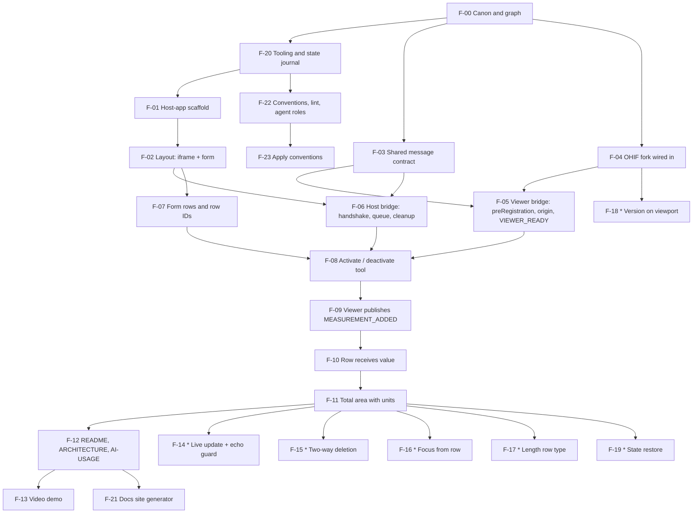

# Feature graph

Derived from [CANON.md](CANON.md). Every node closes at least one canon ID. A node is started only
when all of its `depends_on` are `done`. Bonus nodes (`S-*`) are planned only after the mandatory
part is `done`. The table and the diagram below must always match.

Statuses: `planned` → `approved` → `in-progress` → `review` → `done`.

## Nodes

| Node | Name                                                                                             | Canon                                                   | Depends on       | Slice                                          | Status  | Verify                                                                                                                                                                                                  |
| ---- | ------------------------------------------------------------------------------------------------ | ------------------------------------------------------- | ---------------- | ---------------------------------------------- | ------- | ------------------------------------------------------------------------------------------------------------------------------------------------------------------------------------------------------- |
| F-00 | Canon and feature graph                                                                          | D-2, D-3, D-4, D-6 (decisions section seeded), A-1..A-5 | —                | 0 `docs: canon and feature graph`              | done    | Coverage check: every `C/Q/D` ID appears in this table; no cycles; diagram matches table.                                                                                                               |
| F-01 | Host-app scaffold                                                                                | C-3.3, C-4.2.1, C-4.2.3, A-2                            | F-20             | 1 `chore: bootstrap host-app`                  | done    | `npm run dev` in `host-app/` serves on port 5173; `tsc --noEmit` and lint pass with `strict`.                                                                                                           |
| F-02 | Page layout: iframe + form panel                                                                 | C-4.2.2, C-4.1.3                                        | F-01             | 1                                              | done    | Page shows a full-height flexible iframe on the left pointing at `http://localhost:3000/viewer?StudyInstanceUIDs=…` and a form panel on the right.                                                      |
| F-03 | Shared message contract                                                                          | C-4.4.1, C-4.4.2, C-4.4.3, Q-7, P-7, P-8                | F-00             | 2 `feat: viewer bridge extension`              | done    | Types for the five events with `version: 1`; runtime guard rejects malformed / wrong-version messages; unit tests for serialisation and validation pass (X-4).                                          |
| F-04 | OHIF fork wired in                                                                               | C-4.1.1, C-4.1.2, C-4.1.3, D-1, A-1                     | F-00             | 2                                              | done    | Fork added as submodule under `viewer/`; `yarn dev` serves on port 3000; a direct study link opens with the default public DICOMweb.                                                                    |
| F-05 | Viewer bridge extension: `preRegistration`, origin check, `VIEWER_READY`                         | C-3.1, C-3.2, C-3.4, Q-2, Q-5                           | F-03, F-04       | 2                                              | done    | Extension registered in the fork's app config; on load the parent receives `VIEWER_READY` with correct `targetOrigin`; messages from a foreign origin are ignored (manual `postMessage` from devtools). |
| F-06 | Host bridge client: origin check, handshake, early-command queue, cleanup                        | C-3.1, Q-1, Q-2, Q-5, P-1, P-9                          | F-02, F-03       | 2                                              | done    | Clicking "Activate" before the iframe is ready queues the command; it is flushed after `VIEWER_READY`; listeners are removed on unmount (React StrictMode double-mount leaves one listener).            |
| F-07 | Form rows: add, statuses, row IDs                                                                | C-4.3.1, C-4.3.2, C-4.3.7, Q-3                          | F-02             | 3 `feat: activate ellipse from form`           | done    | "Add measurement" creates rows with unique IDs and status `Pending`; any number of rows can be added.                                                                                                   |
| F-08 | Activate / deactivate tool from a row                                                            | C-4.3.3, C-4.4.1, Q-3, A-4, P-7                         | F-05, F-06, F-07 | 3                                              | done    | "Activate" switches the row to `Drawing…` and the viewer to `EllipticalROI`; cancel sends `DEACTIVATE_TOOL`, row returns to `Pending`, viewer returns to the default tool.                              |
| F-09 | Viewer publishes `MEASUREMENT_ADDED` and auto-deactivates the tool                               | C-3.4, C-4.3.4, C-4.3.5, C-4.3.6, Q-3, Q-6, P-3, P-4    | F-08             | 4 `feat: receive measurement into form`        | done    | Drawing an ellipse produces one `MEASUREMENT_ADDED` with area, units (`mm²` / `px²`), row correlation ID and annotation ID; the viewer tool returns to default.                                         |
| F-10 | Row receives the value                                                                           | C-4.3.5, C-4.3.6, Q-6                                   | F-09             | 4                                              | done    | The correct row shows the value with its unit and status `Done`; a measurement that arrives for an unknown or non-`Drawing…` row is ignored and logged.                                                 |
| F-11 | Total area with unit handling                                                                    | C-4.3.8, Q-6, X-4                                       | F-10             | 5 `feat: total area calculation`               | done    | Sum is shown per unit (mm² and px² never added together); recalculates on every change; unit tests for the sum logic pass.                                                                              |
| F-21 | Docs site generator (`npm run docs:build` → `docs/site/index.html`, clickable requirement IDs)   | D-3, D-6                                                | F-12             | 10 `chore: docs site generator`                | done    | `npm run docs:build` produces a single self-contained page; opening it shows every document, IDs link to canon / graph rows / decision files.                                                           |
| F-22 | Conventions, lint and agent roles (`docs/CONVENTIONS.md`, ESLint + Prettier, `.claude/agents/*`) | Q-7, D-3, A-13                                          | F-20             | 12 `chore: conventions, lint and agent roles`  | done    | `npm run lint` runs ESLint with typescript-eslint strict and react-hooks; `npm run format:check` runs Prettier; agent role files exist and CLAUDE.md points to them.                                    |
| F-23 | Apply conventions to existing code (host-app, contract, extension)                               | Q-7, A-13                                               | F-22             | 13 `refactor: apply conventions`               | review  | `npm run lint` and `format:check` exit 0 with zero warnings; all tests green; fork extension passes the same rules.                                                                                     |
| F-12 | Documentation: README, ARCHITECTURE, AI-USAGE                                                    | D-5, D-6, D-7, P-2, P-5, P-6                            | F-11             | 6 `docs: README, ARCHITECTURE, AI-USAGE`       | done    | Fresh clone → both apps running by following README only; ARCHITECTURE has the diagram, full payload table and "Decisions"; AI-USAGE is honest and specific.                                            |
| F-13 | Video demo                                                                                       | D-8                                                     | F-12             | 6 (recorded by the author, outside the repo)   | planned | 2–4 min recording covering D-8 (a)–(e).                                                                                                                                                                 |
| F-14 | Bonus: live update (`MEASUREMENT_UPDATED`) with echo-loop protection                             | S-5.1, Q-4, P-6                                         | F-11             | 7                                              | done    | Dragging a handle updates the row and the sum live; a host-originated change does not bounce back as a second update.                                                                                   |
| F-15 | Bonus: two-way deletion                                                                          | S-5.2, Q-4, C-4.4.2                                     | F-11             | 8                                              | done    | Row "Delete" removes the annotation; deleting in the viewer clears the row.                                                                                                                             |
| F-16 | Bonus: focus annotation from row                                                                 | S-5.3, C-4.4.2                                          | F-11             | 11                                             | done    | Clicking a row highlights / jumps to the annotation.                                                                                                                                                    |
| F-17 | Bonus: Length row type with separate sum                                                         | S-5.4                                                   | F-11             | 7                                              | planned | Length rows sum separately from area rows.                                                                                                                                                              |
| F-18 | Bonus: OHIF version on every viewport                                                            | S-5.5                                                   | F-04             | 9                                              | done    | Version from `package.json` injected at build time appears on each viewport in a 2×2 grid.                                                                                                              |
| F-19 | Bonus: state restore after reload                                                                | S-5.6                                                   | F-11             | 7                                              | planned | Reload keeps rows and annotations in sync.                                                                                                                                                              |
| F-20 | Project tooling and state journal                                                                | D-2, D-3, D-5, A-6                                      | F-00             | 0.5 `chore: project tooling and state journal` | done    | `npm run check:graph` exits 0; `.nvmrc` + `engines` pin Node 22; `docs/STATE.md` lets a fresh session resume; decision records exist for A-1..A-6.                                                      |

Bonus slices are ordered later by interest; each bonus node is its own slice / PR.

## Coverage of mandatory IDs

| ID range        | Covered by                                                                       |
| --------------- | -------------------------------------------------------------------------------- |
| C-3.1           | F-05, F-06 (the only channel is `postMessage`; enforced by the contract in F-03) |
| C-3.2, C-3.4    | F-05, F-09                                                                       |
| C-3.3           | F-01                                                                             |
| C-4.1.1–C-4.1.3 | F-04, F-02                                                                       |
| C-4.2.1–C-4.2.3 | F-01, F-02                                                                       |
| C-4.3.1–C-4.3.8 | F-07, F-08, F-09, F-10, F-11                                                     |
| C-4.4.1–C-4.4.3 | F-03, F-08                                                                       |
| Q-1             | F-06                                                                             |
| Q-2             | F-05, F-06                                                                       |
| Q-3             | F-07, F-08, F-09                                                                 |
| Q-4             | F-14 (only applicable with S-5.1)                                                |
| Q-5             | F-05, F-06                                                                       |
| Q-6             | F-09, F-10, F-11                                                                 |
| Q-7             | F-03                                                                             |
| D-1             | F-04                                                                             |
| D-2, D-3, D-4   | F-00, F-20 (process; every slice PR)                                             |
| D-5             | F-20 (toolchain pinning), F-12                                                   |
| D-6, D-7        | F-12                                                                             |
| D-8             | F-13                                                                             |
| X-1..X-5        | Constraints on every node; X-4 referenced by F-03, F-11                          |

## Diagram

## Slice → nodes

| Slice | Branch                                    | Nodes                   |
| ----- | ----------------------------------------- | ----------------------- |
| 0     | `docs/canon-and-feature-graph`            | F-00                    |
| 0.5   | `chore/project-tooling-and-state-journal` | F-20                    |
| 1     | `chore/bootstrap-host-app`                | F-01, F-02              |
| 2     | `feat/viewer-bridge-extension`            | F-03, F-04, F-05, F-06  |
| 3     | `feat/activate-ellipse-from-form`         | F-07, F-08              |
| 4     | `feat/receive-measurement-into-form`      | F-09, F-10              |
| 5     | `feat/total-area-calculation`             | F-11                    |
| 6     | `docs/readme-architecture-ai-usage`       | F-12, F-13              |
| 7     | `feat/live-measurement-update`            | F-14                    |
| 8     | `feat/two-way-deletion`                   | F-15                    |
| 9     | `feat/ohif-version-on-viewport`           | F-18                    |
| 10    | `chore/docs-site-generator`               | F-21                    |
| 11    | `feat/focus-measurement-from-row`         | F-16                    |
| 12    | `chore/conventions-lint-and-agent-roles`  | F-22                    |
| 13    | `refactor/apply-conventions`              | F-23                    |
| 14    | `docs/final`                              | F-12 (final pass), F-13 |
| later | one branch per bonus node                 | F-17, F-19              |
